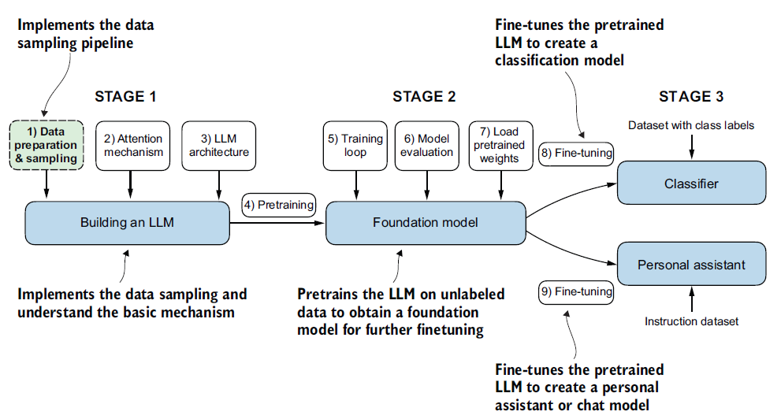
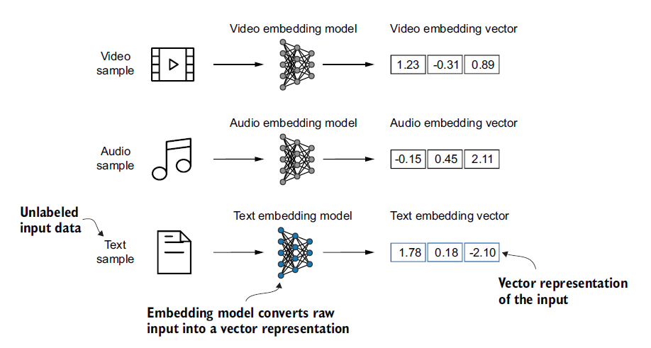
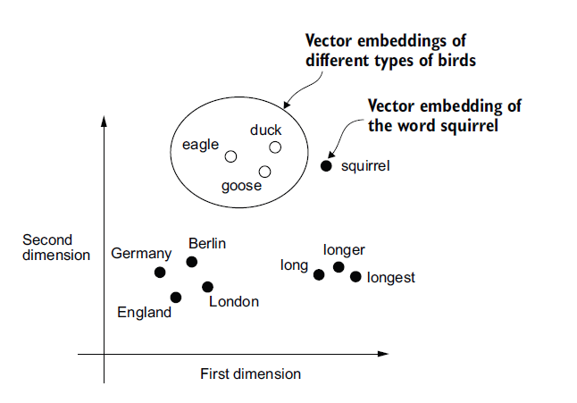
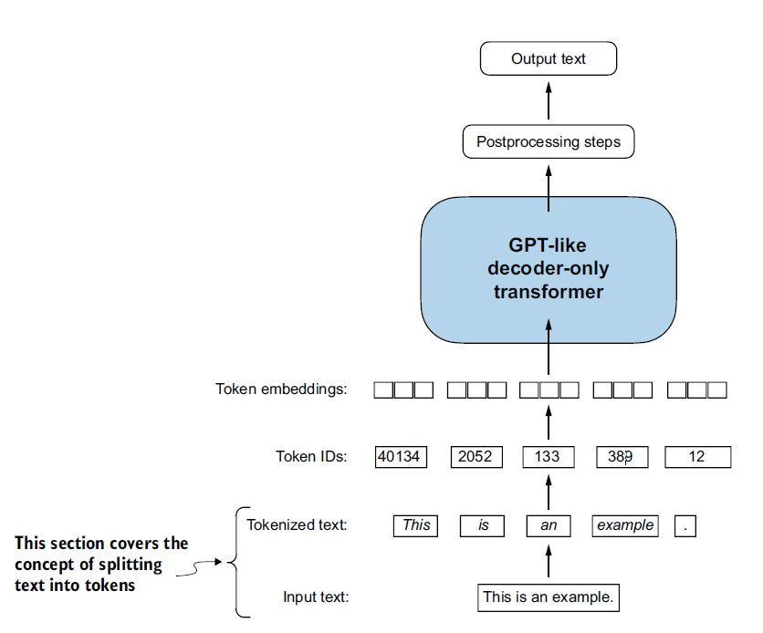
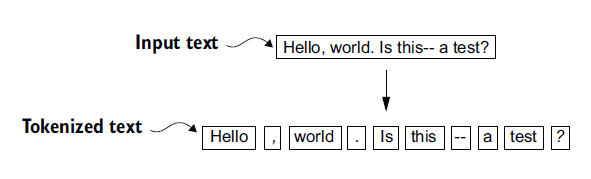

# Notes de lecture : Build a Large Language Model (from scratch)

## Chapitre 2 : Working with text data

### Introduction : Pipeline de préparation des données

Avant même de songer à l'architecture ou à l'entraînement d'un LLM, l'étape la plus cruciale est la préparation des données d'entraînement. C'est l'objectif de la toute première étape de la phase 1 du développement d'un modèle de langage.

Pour pouvoir traiter du texte, un LLM ne lit pas des phrases brutes, mais convertit le texte suivant un pipeline bien précis :
1. **La tokenisation :** Le texte brut est découpé en petites unités appelées *tokens* (qui peuvent être des mots entiers, ou des sous-mots). Des méthodes avancées comme le *Byte Pair Encoding* (BPE) sont généralement utilisées sur les modèles récents comme GPT.
2. **L'échantillonnage :** Grâce à une approche par « fenêtre glissante » (sliding window), on extrait des paires d'entrées et de sorties permettant d'entraîner le modèle à la tâche de prédiction du mot suivant.
3. **La vectorisation :** Les tokens extraits sont ensuite convertis en vecteurs de nombres (embeddings) que le réseau de neurones va pouvoir ingérer et traiter mathématiquement.

<div align="center">




*Figure 2.1 : Les trois grandes étapes pour coder un LLM. Ce chapitre se concentre sur l'étape 1 de la phase 1 : l'implémentation du pipeline d'échantillonnage de données.*

</div>

<br>

### 2.1 Comprendre les embeddings de mots

Les réseaux de neurones ne peuvent pas traiter directement le texte brut, car les algorithmes nécessitent des valeurs numériques continues pour fonctionner. La méthode pour accomplir cela s'appelle l'**embedding** (ou plongement vectoriel).

Un embedding consiste à projeter des objets discrets (mots, phrases, audios, images) vers des points dans un format que la machine peut traiter : un espace vectoriel continu (une suite de nombres). Il est essentiel de comprendre qu'il existe un type de modèle d'embedding pour chaque type de format de données (on ne peut pas utiliser un modèle textuel sur de la vidéo).

<div align="center">




*Figure 2.2 : Les modèles de deep learning ne peuvent pas traiter des formats de données tels que la vidéo, l'audio et le texte dans leur forme brute. Ainsi, nous utilisons un modèle d'embedding pour transformer ces données brutes en une représentation vectorielle dense que les architectures de deep learning peuvent facilement comprendre et traiter. Plus précisément, cette figure illustre le processus de conversion de données brutes en un vecteur numérique tridimensionnel.*

</div>

Dans ce livre, nous nous intéressons uniquement aux **embeddings de mots** puisque la génération des LLM opère un mot à la fois. Historiquement, on utilisait des modèles tiers comme **Word2Vec** pour transformer chaque mot en vecteur. La logique mathématique est élégante : les mots partageant des contextes similaires acquièrent des valeurs mathématiques similaires et se retrouvent par conséquent regroupés (clustered) géométriquement lorsqu'on les affiche dans un espace en deux dimensions. 

<div align="center">




*Figure 2.3 : Si les embeddings de mots sont bidimensionnels, nous pouvons les tracer dans un nuage de points en 2D pour les visualiser, comme montré ici. Lors de l'utilisation de techniques d'embedding de mots, telles que Word2Vec, les mots correspondant à des concepts similaires apparaissent souvent proches les uns des autres dans l'espace d'embedding. Par exemple, différents types d'oiseaux apparaissent plus proches les uns des autres dans l'espace d'embedding qu'ils ne le sont des pays et des villes.*

</div>

Cependant, les LLM modernes ne s'appuient pas sur Word2Vec. Ils utilisent leur propre **couche d'embedding intégrée**, qui s'entraîne et s'optimise en même temps que le reste du modèle, permettant d'adapter les vecteurs aux spécificités exactes des données cibles.

Enfin, la **dimensionnalité** de ces vecteurs est clé : un espace à deux dimensions est utile pour enseigner et visualiser (comme la figure 2.3), mais dans un modèle réel, le nombre de dimensions chiffre très vite pour capturer toute l'expressivité et la nuance de la langue. Plus il y a de dimensions, plus la précision augmente, au détriment de l'efficacité calculatoire. Un petit GPT-2 utilise 768 dimensions pour un seul mot, alors que l'immense GPT-3 en requiert 12 288 !

## 2.2 La tokenization du texte (Tokenizing text)

La tokenization (ou segmentation en lexèmes) est une étape de prétraitement indispensable avant la création d'embeddings pour un LLM. Elle consiste à diviser le texte d'entrée en *tokens* individuels, qui peuvent être des mots isolés ou des caractères spéciaux, y compris la ponctuation.

<div align="center">




*Figure 2.4 : Une vue des étapes de traitement du texte dans le contexte d'un LLM. Ici, nous divisons un texte d'entrée en tokens individuels (mots ou caractères spéciaux).*

</div>

Dans cette section, nous utiliserons la courte nouvelle *"The Verdict"* d'Edith Wharton, disponible dans le domaine public.

Vous pouvez télécharger et lire ce texte avec le code Python suivant :

```python
import urllib.request
url = ("https://raw.githubusercontent.com/rasbt/"
       "LLMs-from-scratch/main/ch02/01_main-chapter-code/"
       "the-verdict.txt")
file_path = "the-verdict.txt"
urllib.request.urlretrieve(url, file_path)

with open("the-verdict.txt", "r", encoding="utf-8") as f:
    raw_text = f.read()

print("Total number of character:", len(raw_text))
print(raw_text[:99])
```

**Résultat :**
```text
Total number of character: 20479
I HAD always thought Jack Gisburn rather a cheap genius--though a good fellow
enough--so it was no
```

Bien que l'entraînement de vrais LLMs implique souvent des millions d'articles (des gigaoctets de texte), nous utiliserons cet échantillon de 20 479 caractères à des fins éducatives pour pouvoir exécuter le code en temps raisonnable sur du matériel grand public.

### Création d'un tokenizer de base avec Python

Afin de diviser le texte et d'obtenir une liste de tokens, nous faisons une courte incursion dans la bibliothèque d'expressions régulières de Python (`re`).

Nous évitons de convertir tout le texte en minuscules, car la capitalisation aide les LLMs à :
- Distinguer les noms propres des noms communs.
- Comprendre la structure des phrases.
- Apprendre à générer du texte avec une capitalisation correcte.

Voici une première tentative de séparation basée uniquement sur les espaces :

```python
import re
text = "Hello, world. This, is a test."
result = re.split(r'(\s)', text)
print(result)
```

**Résultat :**
```text
['Hello,', ' ', 'world.', ' ', 'This,', ' ', 'is', ' ', 'a', ' ', 'test.']
```

Ce schéma fonctionne en grande partie, mais la ponctuation reste collée aux mots (`"Hello,"`). Pour corriger cela, séparons également sur les virgules et les points (`r'([,.]|\s)'`) :

```python
result = re.split(r'([,.]|\s)', text)
print(result)
```

**Résultat :**
```text
['Hello', ',', '', ' ', 'world', '.', '', ' ', 'This', ',', '', ' ', 'is', ' ', 'a', ' ', 'test', '.', '']
```

Un petit problème subsiste : la liste inclut encore les espaces et des chaînes vides. Nous pouvons supprimer ces caractères superflus avec `.strip()` :

```python
result = [item for item in result if item.strip()]
print(result)
```

**Résultat :**
```text
['Hello', ',', 'world', '.', 'This', ',', 'is', 'a', 'test', '.']
```

> **Note sur les espaces :**
> Lors du développement d'un tokenizer simple, le fait d'encoder les espaces comme des caractères séparés ou de les supprimer (via `.strip()`) dépend de votre application. Leurs suppressions réduisent les besoins en mémoire et calcul. Cependant, conserver les espaces est utile pour les modèles sensibles à la structure exacte du texte (comme le code Python, sensible à l'indentation). Ici, nous les supprimons pour simplifier.

Complexifions l'expression régulière pour gérer d'autres signes de ponctuation et les double-tirets, similaires à ceux rencontrés dans *"The Verdict"* :

```python
text = "Hello, world. Is this-- a test?"
result = re.split(r'([,.:;?_!"()\']|--|\s)', text)
result = [item.strip() for item in result if item.strip()]
print(result)
```

**Résultat :**
```text
['Hello', ',', 'world', '.', 'Is', 'this', '--', 'a', 'test', '?']
```

<div align="center">




*Figure 2.5 : Le schéma de tokenization sépare correctement le texte en mots individuels et ponctuations.*

</div>

Maintenant que nous avons un tokenizer de base fonctionnel, appliquons-le à l'entièreté de la nouvelle d'Edith Wharton :

```python
preprocessed = re.split(r'([,.:;?_!"()\']|--|\s)', raw_text)
preprocessed = [item.strip() for item in preprocessed if item.strip()]

print(len(preprocessed))
print(preprocessed[:30])
```

**Résultat :**
```text
4690
['I', 'HAD', 'always', 'thought', 'Jack', 'Gisburn', 'rather', 'a', 'cheap', 'genius', '--', 'though', 'a', 'good', 'fellow', 'enough', '--', 'so', 'it', 'was', 'no', 'great', 'surprise', 'to', 'me', 'to', 'hear', 'that', ',', 'in']
```

