# Notes de lecture : Build a Large Language Model (from scratch)

## Chapitre 2 : Working with text data

### Introduction : Pipeline de préparation des données

Avant même de songer à l'architecture ou à l'entraînement d'un LLM, l'étape la plus cruciale est la préparation des données d'entraînement. C'est l'objectif de la toute première étape de la phase 1 du développement d'un modèle de langage.

Pour pouvoir traiter du texte, un LLM ne lit pas des phrases brutes, mais convertit le texte suivant un pipeline bien précis :
1. **La tokenisation :** Le texte brut est découpé en petites unités appelées *tokens* (qui peuvent être des mots entiers, ou des sous-mots). Des méthodes avancées comme le *Byte Pair Encoding* (BPE) sont généralement utilisées sur les modèles récents comme GPT.
2. **L'échantillonnage :** Grâce à une approche par « fenêtre glissante » (sliding window), on extrait des paires d'entrées et de sorties permettant d'entraîner le modèle à la tâche de prédiction du mot suivant.
3. **La vectorisation :** Les tokens extraits sont ensuite convertis en vecteurs de nombres (embeddings) que le réseau de neurones va pouvoir ingérer et traiter mathématiquement.

<div align="center">

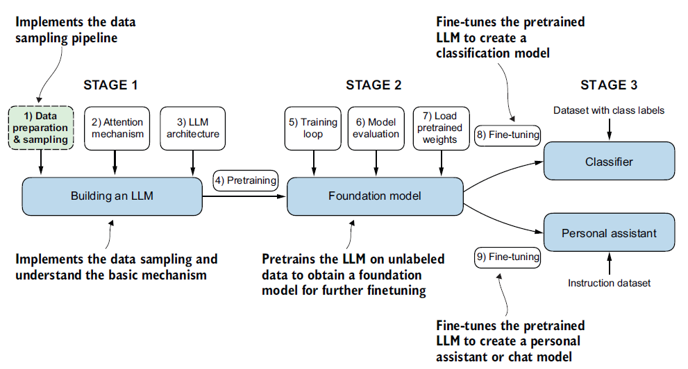


*Figure 2.1 : Les trois grandes étapes pour coder un LLM. Ce chapitre se concentre sur l'étape 1 de la phase 1 : l'implémentation du pipeline d'échantillonnage de données.*

</div>

<br>

### 2.1 Comprendre les embeddings de mots

Les réseaux de neurones ne peuvent pas traiter directement le texte brut, car les algorithmes nécessitent des valeurs numériques continues pour fonctionner. La méthode pour accomplir cela s'appelle l'**embedding** (ou plongement vectoriel).

Un embedding consiste à projeter des objets discrets (mots, phrases, audios, images) vers des points dans un format que la machine peut traiter : un espace vectoriel continu (une suite de nombres). Il est essentiel de comprendre qu'il existe un type de modèle d'embedding pour chaque type de format de données (on ne peut pas utiliser un modèle textuel sur de la vidéo).

<div align="center">

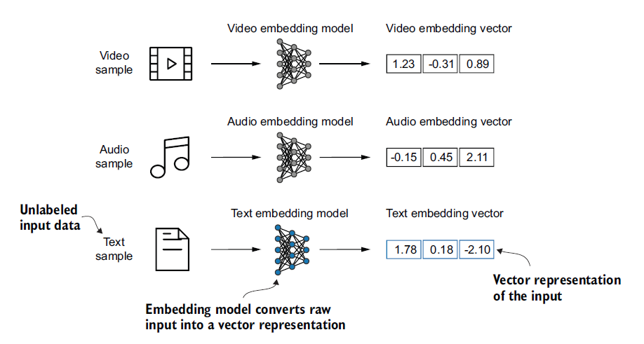


*Figure 2.2 : Les modèles de deep learning ne peuvent pas traiter des formats de données tels que la vidéo, l'audio et le texte dans leur forme brute. Ainsi, nous utilisons un modèle d'embedding pour transformer ces données brutes en une représentation vectorielle dense que les architectures de deep learning peuvent facilement comprendre et traiter. Plus précisément, cette figure illustre le processus de conversion de données brutes en un vecteur numérique tridimensionnel.*

</div>

Dans ce livre, nous nous intéressons uniquement aux **embeddings de mots** puisque la génération des LLM opère un mot à la fois. Historiquement, on utilisait des modèles tiers comme **Word2Vec** pour transformer chaque mot en vecteur. La logique mathématique est élégante : les mots partageant des contextes similaires acquièrent des valeurs mathématiques similaires et se retrouvent par conséquent regroupés (clustered) géométriquement lorsqu'on les affiche dans un espace en deux dimensions. 

<div align="center">

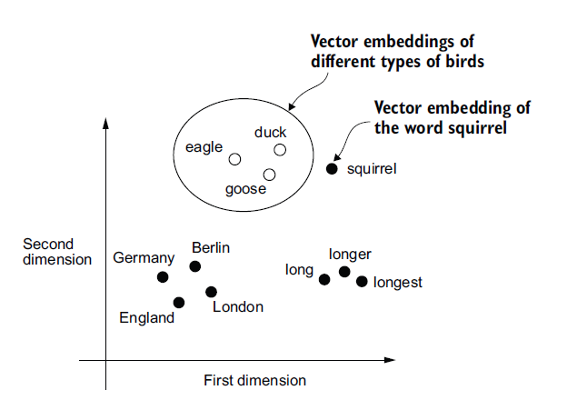


*Figure 2.3 : Si les embeddings de mots sont bidimensionnels, nous pouvons les tracer dans un nuage de points en 2D pour les visualiser, comme montré ici. Lors de l'utilisation de techniques d'embedding de mots, telles que Word2Vec, les mots correspondant à des concepts similaires apparaissent souvent proches les uns des autres dans l'espace d'embedding. Par exemple, différents types d'oiseaux apparaissent plus proches les uns des autres dans l'espace d'embedding qu'ils ne le sont des pays et des villes.*

</div>

Cependant, les LLM modernes ne s'appuient pas sur Word2Vec. Ils utilisent leur propre **couche d'embedding intégrée**, qui s'entraîne et s'optimise en même temps que le reste du modèle, permettant d'adapter les vecteurs aux spécificités exactes des données cibles.

Enfin, la **dimensionnalité** de ces vecteurs est clé : un espace à deux dimensions est utile pour enseigner et visualiser (comme la figure 2.3), mais dans un modèle réel, le nombre de dimensions chiffre très vite pour capturer toute l'expressivité et la nuance de la langue. Plus il y a de dimensions, plus la précision augmente, au détriment de l'efficacité calculatoire. Un petit GPT-2 utilise 768 dimensions pour un seul mot, alors que l'immense GPT-3 en requiert 12 288 !

## 2.2 La tokenization du texte (Tokenizing text)

La tokenization (ou segmentation en lexèmes) est une étape de prétraitement indispensable avant la création d'embeddings pour un LLM. Elle consiste à diviser le texte d'entrée en *tokens* individuels, qui peuvent être des mots isolés ou des caractères spéciaux, y compris la ponctuation.

<div align="center">

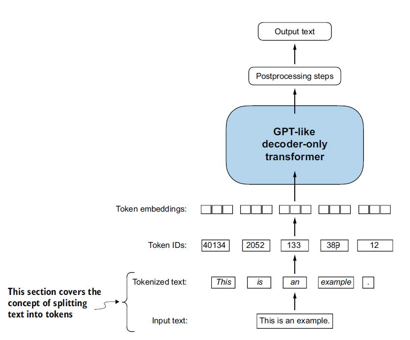


*Figure 2.4 : Une vue des étapes de traitement du texte dans le contexte d'un LLM. Ici, nous divisons un texte d'entrée en tokens individuels (mots ou caractères spéciaux).*

</div>

Dans cette section, nous utiliserons la courte nouvelle *"The Verdict"* d'Edith Wharton, disponible dans le domaine public.

Vous pouvez télécharger et lire ce texte avec le code Python suivant :

```python
import urllib.request
url = ("https://raw.githubusercontent.com/rasbt/"
       "LLMs-from-scratch/main/ch02/01_main-chapter-code/"
       "the-verdict.txt")
file_path = "the-verdict.txt"
urllib.request.urlretrieve(url, file_path)

with open("the-verdict.txt", "r", encoding="utf-8") as f:
    raw_text = f.read()

print("Total number of character:", len(raw_text))
print(raw_text[:99])
```

**Résultat :**
```text
Total number of character: 20479
I HAD always thought Jack Gisburn rather a cheap genius--though a good fellow
enough--so it was no
```

Bien que l'entraînement de vrais LLMs implique souvent des millions d'articles (des gigaoctets de texte), nous utiliserons cet échantillon de 20 479 caractères à des fins éducatives pour pouvoir exécuter le code en temps raisonnable sur du matériel grand public.

### Création d'un tokenizer de base avec Python

Afin de diviser le texte et d'obtenir une liste de tokens, nous faisons une courte incursion dans la bibliothèque d'expressions régulières de Python (`re`).

Nous évitons de convertir tout le texte en minuscules, car la capitalisation aide les LLMs à :
- Distinguer les noms propres des noms communs.
- Comprendre la structure des phrases.
- Apprendre à générer du texte avec une capitalisation correcte.

Voici une première tentative de séparation basée uniquement sur les espaces :

```python
import re
text = "Hello, world. This, is a test."
result = re.split(r'(\s)', text)
print(result)
```

**Résultat :**
```text
['Hello,', ' ', 'world.', ' ', 'This,', ' ', 'is', ' ', 'a', ' ', 'test.']
```

Ce schéma fonctionne en grande partie, mais la ponctuation reste collée aux mots (`"Hello,"`). Pour corriger cela, séparons également sur les virgules et les points (`r'([,.]|\s)'`) :

```python
result = re.split(r'([,.]|\s)', text)
print(result)
```

**Résultat :**
```text
['Hello', ',', '', ' ', 'world', '.', '', ' ', 'This', ',', '', ' ', 'is', ' ', 'a', ' ', 'test', '.', '']
```

Un petit problème subsiste : la liste inclut encore les espaces et des chaînes vides. Nous pouvons supprimer ces caractères superflus avec `.strip()` :

```python
result = [item for item in result if item.strip()]
print(result)
```

**Résultat :**
```text
['Hello', ',', 'world', '.', 'This', ',', 'is', 'a', 'test', '.']
```

> **Note sur les espaces :**
> Lors du développement d'un tokenizer simple, le fait d'encoder les espaces comme des caractères séparés ou de les supprimer (via `.strip()`) dépend de votre application. Leurs suppressions réduisent les besoins en mémoire et calcul. Cependant, conserver les espaces est utile pour les modèles sensibles à la structure exacte du texte (comme le code Python, sensible à l'indentation). Ici, nous les supprimons pour simplifier.

Complexifions l'expression régulière pour gérer d'autres signes de ponctuation et les double-tirets, similaires à ceux rencontrés dans *"The Verdict"* :

```python
text = "Hello, world. Is this-- a test?"
result = re.split(r'([,.:;?_!"()\']|--|\s)', text)
result = [item.strip() for item in result if item.strip()]
print(result)
```

**Résultat :**
```text
['Hello', ',', 'world', '.', 'Is', 'this', '--', 'a', 'test', '?']
```

<div align="center">

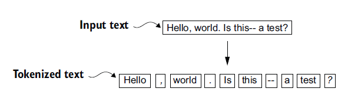


*Figure 2.5 : Le schéma de tokenization sépare correctement le texte en mots individuels et ponctuations.*

</div>

Maintenant que nous avons un tokenizer de base fonctionnel, appliquons-le à l'entièreté de la nouvelle d'Edith Wharton :

```python
preprocessed = re.split(r'([,.:;?_!"()\']|--|\s)', raw_text)
preprocessed = [item.strip() for item in preprocessed if item.strip()]

print(len(preprocessed))
print(preprocessed[:30])
```

**Résultat :**
```text
4690
['I', 'HAD', 'always', 'thought', 'Jack', 'Gisburn', 'rather', 'a', 'cheap', 'genius', '--', 'though', 'a', 'good', 'fellow', 'enough', '--', 'so', 'it', 'was', 'no', 'great', 'surprise', 'to', 'me', 'to', 'hear', 'that', ',', 'in']
```


## 2.3 Convertir les tokens en identifiants (Token IDs)

Une fois le texte divisé en tokens (chaînes de caractères), l'étape suivante consiste à les convertir en nombres entiers (*Token IDs*). C'est une étape intermédiaire obligatoire avant de générer les vecteurs d'embeddings.

Pour transformer les tokens en identifiants, nous devons d'abord construire un **vocabulaire**. Ce vocabulaire mappe chaque mot et caractère spécial unique à un nombre entier de façon unique.

<div align="center">

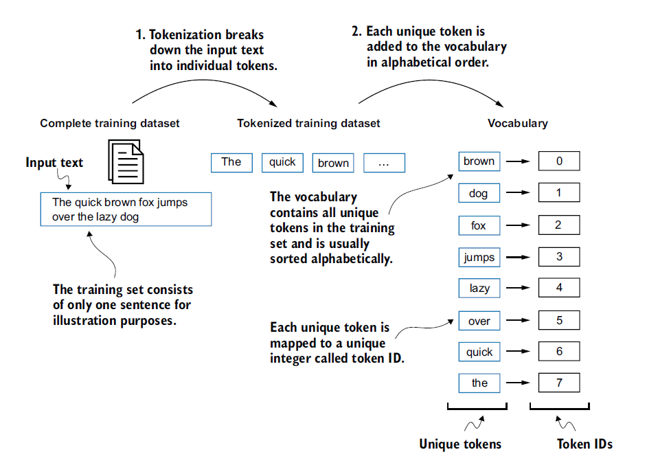

*Figure 2.6 : Construction d'un vocabulaire en tokenisant l'ensemble du dataset d'entraînement. Les tokens sont extraits, triés par ordre alphabétique, et les doublons retirés. Le vocabulaire fait correspondre chaque token unique à une valeur entière unique.*

</div>

Créons la liste de tous les tokens uniques et trions-les pour déterminer la taille de notre vocabulaire :

```python
all_words = sorted(set(preprocessed))
vocab_size = len(all_words)
print(vocab_size)
```

**Résultat :**
```text
1130
```

Le vocabulaire contient 1 130 tokens différents. Nous pouvons maintenant créer le dictionnaire qui associe chaque token à un numéro :

```python
vocab = {token:integer for integer,token in enumerate(all_words)}
for i, item in enumerate(vocab.items()):
    print(item)
    if i >= 50:
        break
```

**Résultat :**
```text
('!', 0)
('"', 1)
("'", 2)
...
('Her', 49)
('Hermia', 50)
```

<div align="center">

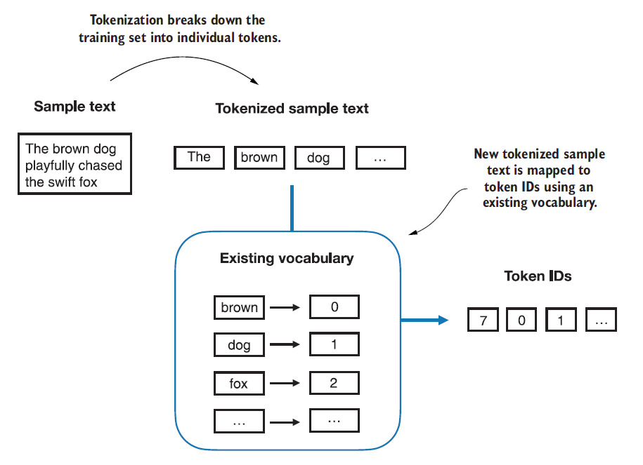

*Figure 2.7 : À partir d'un nouvel échantillon de texte, nous le tokenisons et utilisons le vocabulaire pour convertir les tokens textuels en token IDs.*

</div>

### Implémentation d'une classe Tokenizer

Pour automatiser ce processus, nous allons implémenter une classe Python `SimpleTokenizerV1`. Elle comprendra :
- Une méthode `encode()` pour diviser un texte en tokens et le transformer en IDs.
- Une méthode `decode()` pour effectuer l'opération inverse (de Token IDs vers textes), indispensable pour lire la sortie générée par le modèle.

```python
class SimpleTokenizerV1:
    def __init__(self, vocab):
        self.str_to_int = vocab  # Stocke le vocabulaire pour l'encodage
        self.int_to_str = {i:s for s,i in vocab.items()}  # Vocabulaire inversé pour le décodage

    def encode(self, text):
        preprocessed = re.split(r'([,.?_!"()\']|--|\s)', text)
        preprocessed = [item.strip() for item in preprocessed if item.strip()]
        ids = [self.str_to_int[s] for s in preprocessed]
        return ids

    def decode(self, ids):
        text = " ".join([self.int_to_str[i] for i in ids])
        # Supprime les espaces insérés avant la ponctuation
        text = re.sub(r'\s+([,.?!"()\'])', r'\1', text) 
        return text
```

<div align="center">

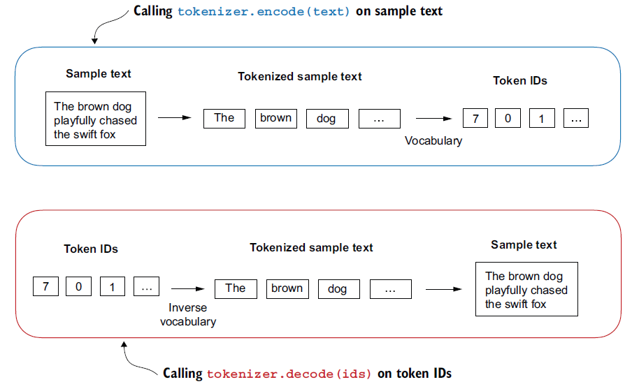

*Figure 2.8 : Les implémentations de tokenizers partagent deux méthodes communes : encode (convertit le texte en ID via le vocabulaire) et decode (reconvertit les IDs en texte naturel).*

</div>

Testons notre classe sur un extrait de la nouvelle :

```python
tokenizer = SimpleTokenizerV1(vocab)
text = """"It's the last he painted, you know,"
Mrs. Gisburn said with pardonable pride."""
ids = tokenizer.encode(text)
print(ids)
```

**Résultat :**
```text
[1, 56, 2, 850, 988, 602, 533, 746, 5, 1126, 596, 5, 1, 67, 7, 38, 851, 1108, 754, 793, 7]
```

Décodons maintenant cette liste d'IDs pour vérifier si nous retrouvons la phrase originale :

```python
print(tokenizer.decode(ids))
```

**Résultat :**
```text
'" It\' s the last he painted, you know," Mrs. Gisburn said with pardonable pride.'
```

Le décodeur fonctionne bien ! Essayons maintenant un nouveau texte qui n'est pas issu de la nouvelle d'Edith Wharton :

```python
text = "Hello, do you like tea?"
print(tokenizer.encode(text))
```

**Résultat :**
```text
KeyError: 'Hello'
```

**Problème :** Le mot "Hello" n'apparaît pas dans la nouvelle *"The Verdict"*, il est donc absent de notre vocabulaire. Cela démontre pourquoi les LLMs doivent être entraînés sur de gigantesques ensembles de données diversifiés pour étendre leur vocabulaire (et pourquoi nous aurons besoin de tokens spéciaux pour gérer les mots inconnus).

## 2.4 Ajouter des tokens de contexte spéciaux (Adding special context tokens)

Il est indispensable de modifier le tokenizer pour gérer les mots inconnus. De plus, l'ajout de tokens de contexte spéciaux permet d'améliorer la compréhension du modèle, par exemple pour marquer la fin ou le début d'un document. Nous allons ajouter deux nouveaux tokens : `<|unk|>` pour les mots inconnus, et `<|endoftext|>` pour séparer des documents textuels indépendants.

<div align="center">

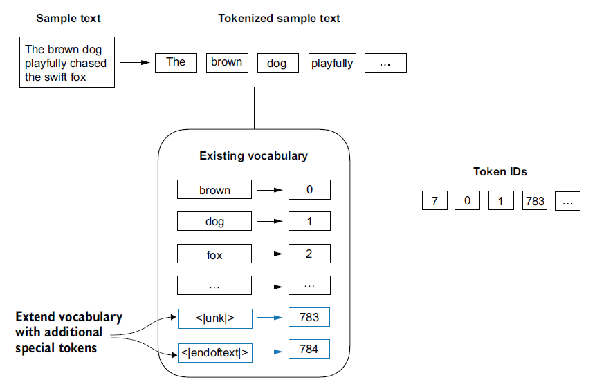

*Figure 2.9 : Ajout des tokens spéciaux `<|unk|>` (pour les mots inconnus) et `<|endoftext|>` (pour séparer deux sources de texte non liées) au vocabulaire.*

</div>

L'ajout du token `<|endoftext|>` est crucial lorsqu'on entraîne des LLMs de type GPT sur de multiples documents ou livres indépendants. Cela aide le modèle à comprendre que, bien que concaténés à la chaîne pour l'entraînement, ces textes n'ont aucun lien contextuel entre eux.

<div align="center">

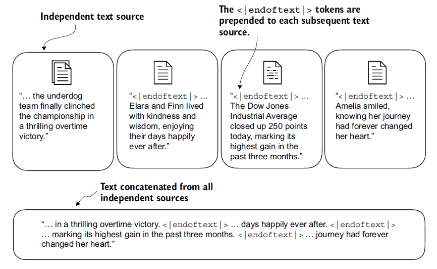

*Figure 2.10 : Lors du traitement de plusieurs sources de texte indépendantes, le token `<|endoftext|>` agit comme un marqueur signalant le début ou la fin d'un segment.*

</div>

### Mise à jour du vocabulaire

Ajoutons ces deux tokens spéciaux à la suite de notre liste de mots uniques, puis vérifions la nouvelle taille du vocabulaire :

```python
all_tokens = sorted(list(set(preprocessed)))
all_tokens.extend(["<|endoftext|>", "<|unk|>"])
vocab = {token:integer for integer,token in enumerate(all_tokens)}
print(len(vocab.items()))
```

**Résultat :**
```text
1132
```
Le vocabulaire compte bien à présent 1 132 valeurs (au lieu de 1 130). Imprimons les cinq dernières entrées du dictionnaire pour le confirmer :

```python
for i, item in enumerate(list(vocab.items())[-5:]):
    print(item)
```

**Résultat :**
```text
('younger', 1127)
('your', 1128)
('yourself', 1129)
('<|endoftext|>', 1130)
('<|unk|>', 1131)
```

### Le Tokenizer V2 gérant les mots inconnus

Nous pouvons ajuster la méthode `encode` de notre classe précédente. Désormais, si un mot rencontré dans le texte fourni n'est pas présent dans la base de données de notre `self.str_to_int`, nous lui associons d'office le token `<|unk|>`.

```python
class SimpleTokenizerV2:
    def __init__(self, vocab):
        self.str_to_int = vocab
        self.int_to_str = { i:s for s,i in vocab.items()}

    def encode(self, text):
        preprocessed = re.split(r'([,.:;?_!"()\']|--|\s)', text)
        preprocessed = [item.strip() for item in preprocessed if item.strip()]
        
        # Filtre de sécurité pour les mots inconnus
        preprocessed = [item if item in self.str_to_int else "<|unk|>" for item in preprocessed]
        ids = [self.str_to_int[s] for s in preprocessed]
        return ids

    def decode(self, ids):
        text = " ".join([self.int_to_str[i] for i in ids])
        text = re.sub(r'\s+([,.:;?!"()\'])', r'\1', text)
        return text
```

Testons cette nouvelle version sur un échantillon composé de deux phrases indépendantes concaténées avec notre fameux marqueur, pour vérifier la mise en place du texte de test :

```python
text1 = "Hello, do you like tea?"
text2 = "In the sunlit terraces of the palace."
text = " <|endoftext|> ".join((text1, text2))
print(text)
```

**Résultat :**
```text
Hello, do you like tea? <|endoftext|> In the sunlit terraces of the palace.
```

Maintenant, encodons ce texte complet et regardons les identifiants générés :

```python
tokenizer = SimpleTokenizerV2(vocab)
print(tokenizer.encode(text))
```

**Résultat :**
```text
[1131, 5, 355, 1126, 628, 975, 10, 1130, 55, 988, 956, 984, 722, 988, 1131, 7]
```
*(On observe bien la présence du token *1130* correspondant au `<|endoftext|>` et deux compteurs *1131* pour `<|unk|>` correspondant aux mots hors-vocabulaire).*

Décryptons les identités pour le voir de nos propres yeux :

```python
print(tokenizer.decode(tokenizer.encode(text)))
```

**Résultat :**
```text
<|unk|>, do you like tea? <|endoftext|> In the sunlit terraces of the <|unk|>.
```

En comparant ce texte détokenisé avec le texte d'entrée original, nous pouvons en déduire que le dataset d'entraînement, l'histoire courte d'Edith Wharton "The Verdict", ne contient pas les mots "Hello" et "palace". Ces mots ont donc été remplacés par `<|unk|>`.

### Autres types de tokens contextuels

Selon le LLM, certains chercheurs considèrent également d'autres tokens spéciaux supplémentaires tels que :
- **`[BOS]` (Beginning of sequence)** : Ce token marque le début d'un texte. Il indique au LLM où commence un fragment de contenu.
- **`[EOS]` (End of sequence)** : Ce token est positionné à la fin d'un texte et est particulièrement utile lorsque l'on concatène plusieurs textes non liés, de manière similaire à `<|endoftext|>`. Par exemple, lors de la combinaison de deux articles Wikipédia ou livres différents, le token `[EOS]` indique où l'un se termine et où le suivant commence.
- **`[PAD]` (Padding)** : Lors de l'entraînement de LLMs avec des tailles de lots (*batch sizes*) supérieures à un, le batch peut contenir des textes de longueurs variables. Pour s'assurer que tous les textes ont la même longueur, les textes plus courts sont prolongés ou "rembourrés" (*padded*) en utilisant le token `[PAD]`, jusqu'à atteindre la longueur du texte le plus long du lot.

> **La particularité du tokenizer des modèles GPT**
>
> Le tokenizer des modèles GPT se distingue par sa simplicité. Au lieu de multiplier les tokens spéciaux, il n'utilise que `<|endoftext|>` comme équivalent à `[BOS]` et `[EOS]`.
>
> Ce token `<|endoftext|>` sert également pour le *padding*. Lors de l'entraînement par lots (*batchs*), un masque (*mask*) est appliqué pour que le modèle ignore simplement ces tokens de remplissage. Le choix du token spécifique pour le padding n'a donc aucune importance.
>
> Enfin, ce tokenizer n'utilise pas de token `<|unk|>` pour les mots hors-vocabulaire (*out-of-vocabulary*). Il utilise plutôt un algorithme appelé encodage par paire d'octets (*Byte Pair Encoding* ou `BPE`), qui décompose les mots inconnus en sous-mots (*subword units*), comme nous le verrons dans la section suivante.

## 2.5 L'Encodage par paire d'octets (Byte Pair Encoding - BPE)

Examinons un schéma de tokenisation plus sophistiqué basé sur un concept appelé encodage par paire d'octets (Byte Pair Encoding - BPE). Le tokenizer BPE a été utilisé pour entraîner des LLMs tels que GPT-2, GPT-3 et le modèle original utilisé dans ChatGPT.

Ici, nous allons utiliser une bibliothèque open-source Python existante appelée `tiktoken` (https://github.com/openai/tiktoken), qui implémente l'algorithme BPE de manière très. De même que pour d'autres bibliothèques Python, nous pouvons installer la bibliothèque `tiktoken` via l'installateur de paquets `pip` depuis le terminal :

```bash
pip install tiktoken
```

Vérification de la version :

```python
from importlib.metadata import version
import tiktoken

print("tiktoken version:", version("tiktoken"))
```

**Résultat :**
```text
tiktoken version: 0.7.0
```

Initialisation d'un tokenizer BPE (modèle "gpt2") :

```python
tokenizer = tiktoken.get_encoding("gpt2")
```

**Encodage d'un texte (y compris les tokens de contrôle contextuel) :**

```python
text = (
    "Hello, do you like tea? <|endoftext|> In the sunlit terraces"
    "of someunknownPlace."
)
# Le paramètre allowed_special évite que le tokenizer lève une erreur en voyant le token <|endoftext|>
integers = tokenizer.encode(text, allowed_special={"<|endoftext|>"})
print(integers)
```

**Résultat :**
```text
[15496, 11, 466, 345, 588, 8887, 30, 220, 50256, 554, 262, 4252, 18250, 8812, 2114, 286, 617, 34680, 27271, 13]
```

**Décodage inverse :**

```python
strings = tokenizer.decode(integers)
print(strings)
```

**Résultat :**
```text
Hello, do you like tea? <|endoftext|> In the sunlit terraces of someunknownPlace.
```

### Observations fondamentales sur le Tokenizer BPE

Cette expérimentation met en évidence **deux faits remarquables** inhérents au tokenizer BPE de la famille GPT :

1. **La position du token `<|endoftext|>`** : Son ID attribué est très grand (50256). C'est logique : le vocabulaire total des modèles type GPT-2 ou GPT-3 est limité à **50 257** tokens, avec `<|endoftext|>` occupant l'ultime position à la fin.
2. **La gestion robuste des mots "hors-vocabulaire" (OOV)** : Le tokenizer parvient à re-transformer et décoder parfaitement `someunknownPlace` sans avoir à effectuer de "fallback" vers un token aveugle comme `<|unk|>`.

**Comment le BPE se passe-t-il totalement du token `<|unk|>` ?**

La force du BPE réside dans sa capacité à **fractionner** un mot totalement inconnu. Au lieu de lever une erreur ou de le remplacer brutalement par `<|unk|>`, le BPE segmente le mot en fragments plus petits : des syllabes / sous-mots ("subwords") connus ou, s'il le faut en dernier recours, en caractères ou octets individuels.

<div align="center">

> 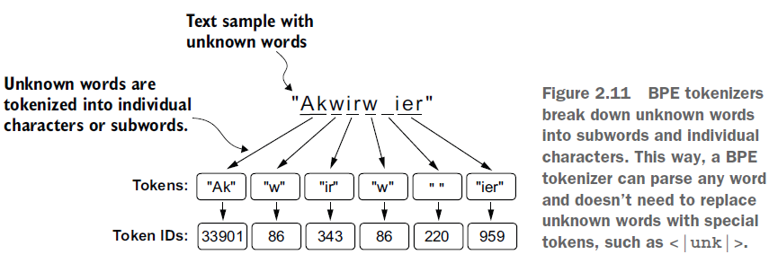
>
> *Figure 2.11 : Les tokenizers BPE décomposent les mots inconnus en sous-mots et en caractères individuels. Ainsi, un tokenizer BPE peut analyser n'importe quel mot et n'a pas besoin de remplacer les mots inconnus par des tokens spéciaux, tels que `<|unk|>`.*

</div>

Cette capacité de décomposer les mots inconnus en caractères individuels garantit que le tokenizer, et par conséquent le LLM, peut traiter n'importe quel texte, même s'il contient des mots absents de ses données d'entraînement

### Exercice 2.1 : Encodage par paire d'octets de mots inconnus

> Essayez le tokenizer BPE de la bibliothèque `tiktoken` sur le mot inconnu "Akwirw ier" et affichez les identifiants de tokens (token IDs) individuels. Ensuite, appelez la fonction de décodage sur chacun des entiers obtenus dans cette liste pour reproduire le mappage logiquement dicté par le BPE. Pour finir, appelez la méthode de décodage sur l'ensemble final des identifiants de tokens pour vérifier s'il parvient à reconstruire l'entrée d'origine de la figure 2.11.

**Solution :**

En passant manuellement chaque sous-fragment perçu du mot de la figure 2.11 au tokenizer :

```python
print(tokenizer.encode("Ak"))
print(tokenizer.encode("w"))
# ...
```

**Résultat :**
```text
[33901]
[86]
# ...
```

Une fois assemblés, un unique appel repasse la liste d'IDs au tokenizer, reconstituant fidèlement la chaîne de départ :

```python
print(tokenizer.decode([33901, 86, 343, 86, 220, 959]))
```

**Résultat :**
```text
Akwirw ier
```


En bref, le BPE construit son vocabulaire de manière progressive, en partant de la plus petite unité. Il initialise d'abord son vocabulaire avec tous les caractères individuels (par exemple "a", "b", etc.). Ensuite, il repère les caractères qui apparaissent le plus souvent côte à côte pour les fusionner en sous-mots. Par exemple, si "d" et "e" sont très souvent adjacents, ils sont fusionnés pour créer le sous-mot "de" (très courant dans des mots comme "define" ou "made"). Ce mécanisme se répète itérativement, fusionnant les sous-mots les plus fréquents en mots entiers, uniquement sur la base de leur fréquence d'apparition.

## 2.6 Échantillonnage des données avec une fenêtre glissante (Sliding window)

Pour entraîner un LLM, on génère des paires entrée-cible (input-target pairs). La tâche du modèle étant de prédire le mot suivant, la séquence cible (`y`) correspond exactement à la séquence d'entrée (`x`), mais décalée d'une position vers la droite.

<div align="center">

> 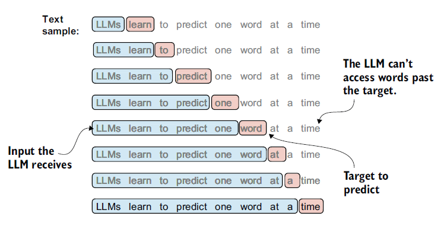
>
> *Figure 2.12 : Extraction de blocs d'entrée (input blocks) à partir d'un échantillon de texte pour l'entraînement du LLM. La tâche consiste à prédire le mot suivant le bloc d'entrée, en masquant les mots qui suivent la cible. (La tokenisation est omise ici pour plus de clarté).*

</div>

Pour créer ces paires, on fait glisser une fenêtre sur le texte tokenisé. La taille du contexte (`context_size` ou `max_length`) détermine le nombre de tokens de l'entrée.

```python
# Exemple de décalage d'une position pour créer la cible
context_size = 4
x = enc_sample[:context_size]
y = enc_sample[1:context_size+1]
print(f"x: {x}") # [290, 4920, 2241, 287]
print(f"y: {y}") # [4920, 2241, 287, 257]
```

### Implémentation du pipeline de données avec PyTorch

Pour l'entraînement, les données doivent être converties en tenseurs et organisées en lots. On utilise pour cela deux classes standard de PyTorch : `Dataset` et `DataLoader`.

<div align="center">

> 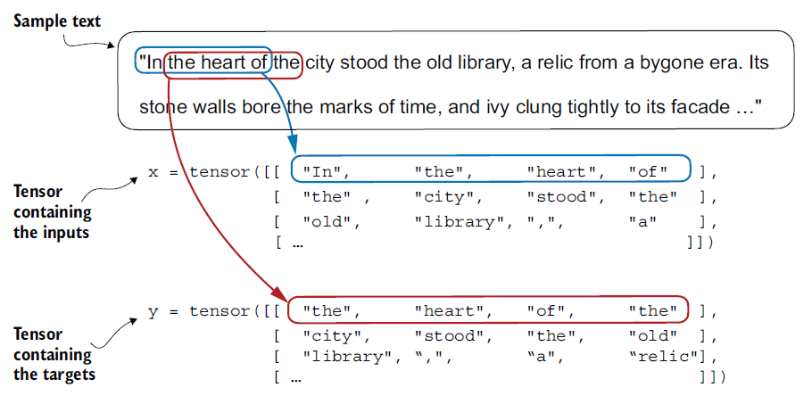
>
> *Figure 2.13 : Pour une efficacité maximale, les entrées sont regroupées dans un tenseur `x`, où chaque ligne représente le contexte d'entrée. Un second tenseur `y` contient les cibles prédictives correspondantes (les mots suivants), créées en décalant l'entrée d'une position.*

</div>

**1. La classe Dataset (`GPTDatasetV1`)** : 
Cette classe définit comment découper le texte en séquences individuelles. Elle divise le texte en blocs de la taille de `max_length` pour les entrées, et crée les blocs cibles correspondants en les décalant d'un token.

```python
import torch
from torch.utils.data import Dataset, DataLoader

class GPTDatasetV1(Dataset):
    def __init__(self, txt, tokenizer, max_length, stride):
        self.input_ids = []
        self.target_ids = []
        
        # Tokenisation de tout le texte
        token_ids = tokenizer.encode(txt)
        
        # Utilisation d'une fenêtre glissante pour créer les séquences
        for i in range(0, len(token_ids) - max_length, stride):
            input_chunk = token_ids[i:i + max_length]
            target_chunk = token_ids[i + 1: i + max_length + 1]
            
            self.input_ids.append(torch.tensor(input_chunk))
            self.target_ids.append(torch.tensor(target_chunk))

    def __len__(self):
        return len(self.input_ids)

    def __getitem__(self, idx):
        return self.input_ids[idx], self.target_ids[idx]
```

**2. La classe DataLoader** : 
Le `DataLoader` regroupe les séquences du `Dataset` en lots (batches). Cela permet au modèle de traiter plusieurs exemples en parallèle.

```python
import tiktoken

def create_dataloader_v1(txt, batch_size=4, max_length=256, stride=128, shuffle=True, drop_last=True, num_workers=0):
    tokenizer = tiktoken.get_encoding("gpt2")
    dataset = GPTDatasetV1(txt, tokenizer, max_length, stride)
    
    dataloader = DataLoader(
        dataset,
        batch_size=batch_size,
        shuffle=shuffle,
        drop_last=drop_last,
        num_workers=num_workers
    )
    return dataloader
```

### Paramètres importants du DataLoader

- **Batch Size (Taille du lot)** : Le nombre de séquences traitées simultanément. Une taille de 1 est utile pour l'illustration, mais en apprentissage profond, on utilise des lots plus grands pour stabiliser les mises à jour du modèle.
- **Drop Last (`drop_last=True`)** : Si le nombre total de séquences n'est pas divisible par la taille du lot, le dernier lot sera incomplet. L'ignorer (le supprimer) permet d'éviter des instabilités (pics de perte) de l'entraînement.
- **Stride (Le pas)** : Détermine de combien de positions la fenêtre glissante avance pour extraire la séquence suivante. 
  - Un `stride` de 1 fait avancer la fenêtre d'un seul token, créant beaucoup de chevauchements entre les séquences consécutives (pratique pour visualiser le mécanisme).
  - En pratique lors de l'entraînement, on définit souvent le `stride` à la même valeur que `max_length`. Cela empêche les séquences de se chevaucher, limitant ainsi le surapprentissage (overfitting).

<div align="center">

> 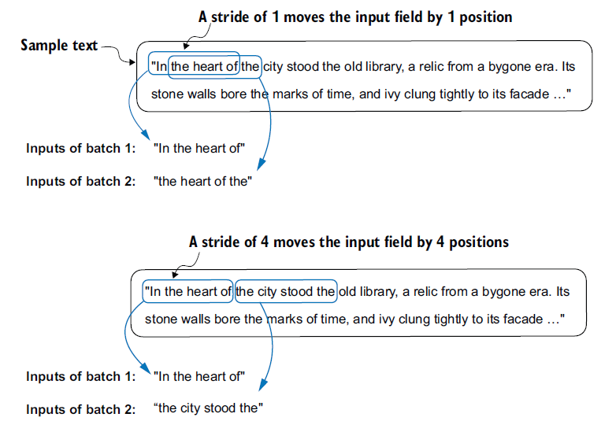
>
> *Figure 2.14 : En définissant un pas (stride) égal à la taille de la fenêtre d'entrée (input window size), on évite tout chevauchement entre les lots.*

</div>

### Exercice 2.2 : Data loaders avec différents strides et context sizes

> Essayez le data loader avec d'autres paramètres comme `max_length=2` et `stride=2`, ou encore `max_length=8` et `stride=2` pour développer votre intuition de la mécanique de la fenêtre glissante.


## 2.7 Création des embeddings de tokens (Token embeddings)

La dernière étape de la préparation des données consiste à convertir les identifiants de tokens (token IDs) en vecteurs d'intégration continus (embedding vectors). Cette représentation vectorielle est requise car les LLMs sont des réseaux de neurones profonds entraînés par l'algorithme de rétropropagation (backpropagation).

Les poids de la matrice d'embeddings sont initialisés avec de petites valeurs aléatoires qui seront optimisées pendant l'entraînement du modèle.

<div align="center">

> 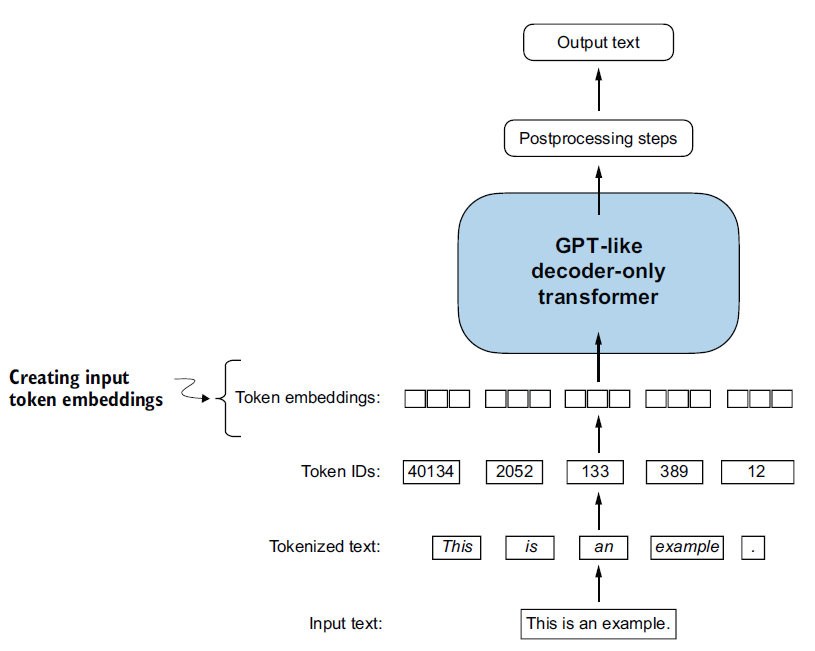
>
> *Figure 2.15 : La préparation du texte passe par la tokenisation, la conversion en identifiants (token IDs), et enfin la projection de ces identifiants en vecteurs continus via une couche d'embedding.*

</div>

### Fonctionnement d'une couche d'embedding avec PyTorch

On instancie une telle couche avec `torch.nn.Embedding`. Ses dimensions dépendent de deux paramètres :
- `vocab_size` : La taille du vocabulaire (le nombre de lignes).
- `output_dim` : Le nombre de dimensions de chaque vecteur d'embedding (le nombre de colonnes).

L'application d'un token ID à cette couche effectue une **opération de recherche (lookup operation)** : elle récupère directement la ligne de la matrice correspondant à cet identifiant.

```python
# Exemple d'extraction de vecteurs pour input_ids = [2, 3, 5, 1]
# vocab_size = 6, output_dim = 3
print(embedding_layer(input_ids))

tensor([[ 1.2753, -0.2010, -0.1606],   # Ligne d'index 2
        [-0.4015,  0.9666, -1.1481],   # Ligne d'index 3
        [-2.8400, -0.7849, -1.4096],   # Ligne d'index 5
        [ 0.9178,  1.5810,  1.3010]],  # Ligne d'index 1
       grad_fn=<EmbeddingBackward0>)
```

<div align="center">

> 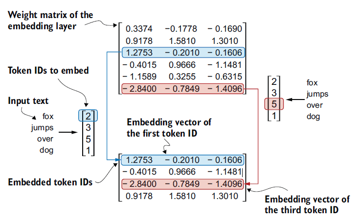
>
> *Figure 2.16 : L'extraction de vecteurs d'embedding. Chaque token ID sert d'index pour extraire la ligne correspondante depuis la matrice de poids de la couche d'embedding.*

</div>

> **Note sur le One-hot encoding :**
> Utiliser une couche d'embedding est mathématiquement et fondamentalement équivalent à appliquer un encodage "one-hot" suivi d'une multiplication matricielle (couche fully connected). La couche d'embedding est cependant une implémentation beaucoup plus efficace en termes de calculs, tout en restant un composant différentiable pour la rétropropagation.
