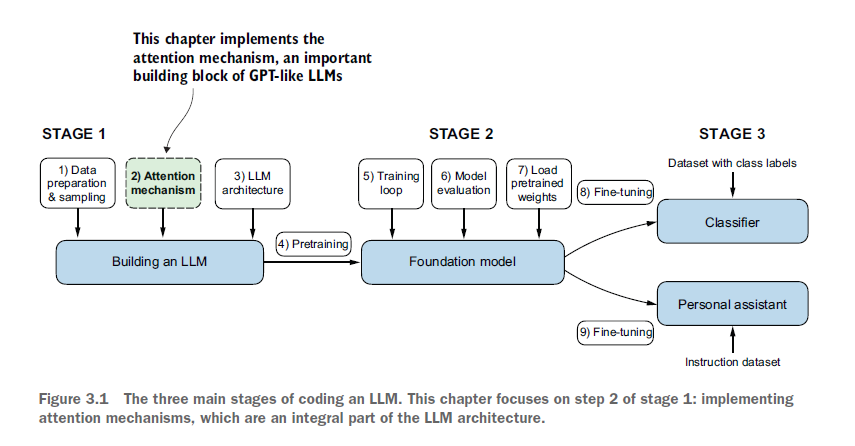
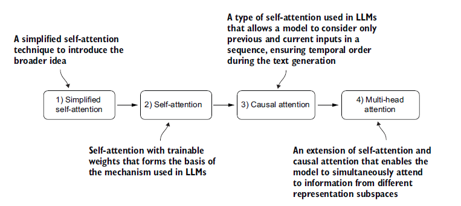
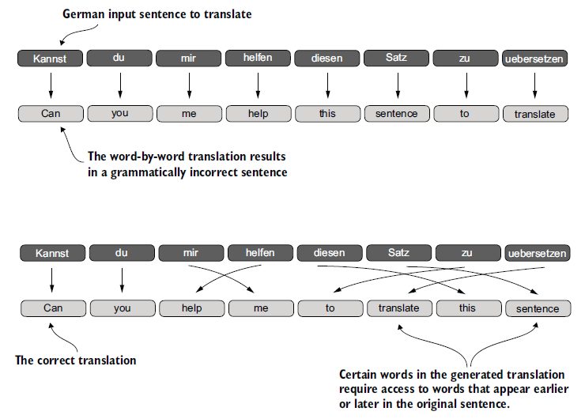
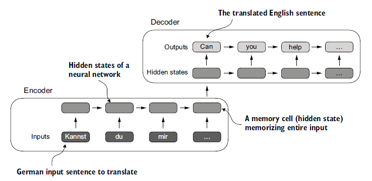
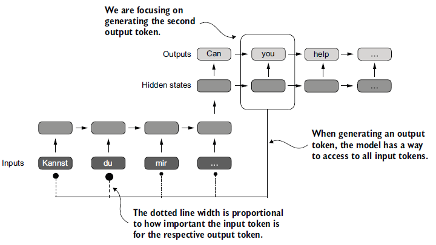
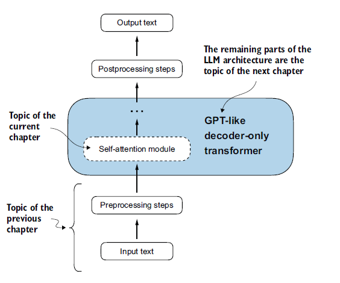
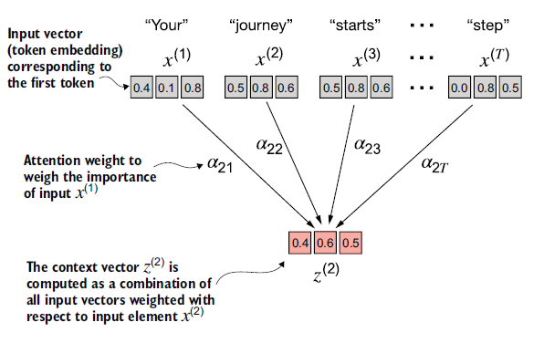
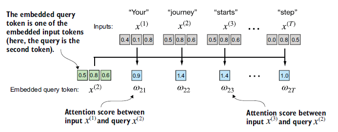
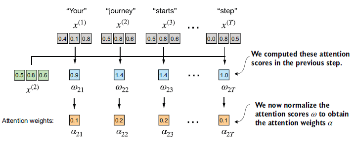
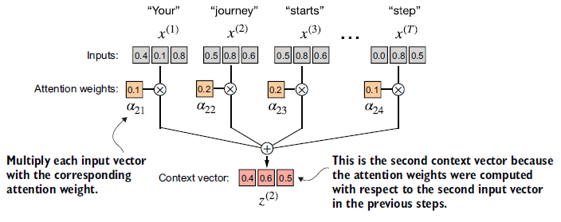

## Chapitre 3 — Mécanismes d'attention

### Introduction

Ce chapitre porte sur les **mécanismes d'attention**, qui constituent le cœur de l'architecture des LLMs. L'objectif est d'en comprendre le fonctionnement de manière isolée et mécanique, avant de les intégrer dans le modèle complet au chapitre 4.

<div align="center">



*Figure 3.1 : Les trois grandes étapes de la construction d'un LLM. Ce chapitre se concentre sur l'étape 2 de la phase 1 : l'implémentation des mécanismes d'attention.*

</div>

Quatre variantes du mécanisme d'attention seront implémentées progressivement, chacune construisant sur la précédente :

1. **Self-attention simplifiée** — version épurée, sans poids apprenables, pour saisir la logique fondamentale.
2. **Self-attention avec poids apprenables** — version complète, entraînable.
3. **Attention causale** (*causal attention*) — un masque est ajouté pour que le modèle ne puisse pas « voir » les tokens futurs lors de la génération, token par token.
4. **Attention multi-têtes** (*multi-head attention*) — plusieurs mécanismes d'attention opèrent en parallèle, permettant au modèle de capturer simultanément différents aspects des relations entre tokens.

<div align="center">



*Figure 3.2 : Les quatre variantes d'attention implémentées dans ce chapitre, de la self-attention simplifiée jusqu'à l'attention multi-têtes.*

</div>

L'implémentation finale de l'attention multi-têtes sera directement réutilisée dans l'architecture du LLM au chapitre suivant.

---

### 3.1 Le problème de la modélisation des longues séquences

Avant d'introduire le mécanisme de *self-attention*, il est utile de comprendre le problème qu'il vient résoudre — et pourquoi les architectures qui le précèdent étaient insuffisantes.

#### Le contexte : la traduction automatique

Prenons l'exemple d'un modèle de traduction. Une traduction mot à mot est impossible : les structures grammaticales des langues source et cible divergent trop profondément.

<div align="center">



*Figure 3.3 : Traduire mot à mot est insuffisant. La traduction exige une compréhension du contexte global et un réalignement grammatical entre les deux langues.*

</div>

La solution classique consiste à utiliser une architecture **encodeur–décodeur** : l'encodeur lit et compresse la séquence d'entrée, le décodeur produit la séquence traduite à partir de cette représentation compressée.

#### L'architecture encodeur–décodeur avec RNN

Avant les Transformers, les **réseaux de neurones récurrents** (RNNs) dominaient cette tâche. Un RNN traite la séquence token par token, en maintenant un **état caché** (*hidden state*) mis à jour à chaque étape — une sorte de mémoire interne qui se propage au fil de la séquence.

Dans un RNN encodeur–décodeur :
- L'**encodeur** parcourt toute la séquence d'entrée et tente de condenser son sens dans un **unique vecteur d'état caché final**.
- Le **décodeur** prend ce vecteur comme point de départ et génère la traduction token par token, en maintenant son propre état caché à chaque étape.

<div align="center">



*Figure 3.4 : Dans un RNN encodeur–décodeur, l'encodeur compresse toute la séquence source en un unique état caché final, que le décodeur utilise ensuite pour générer la traduction token par token.*

</div>

#### La limite fondamentale

Ce vecteur d'état caché final constitue le **goulot d'étranglement** de l'architecture. Toute l'information de la séquence d'entrée — quelle que soit sa longueur — doit tenir dans ce seul vecteur. Lors du décodage, le modèle n'a plus accès aux états cachés intermédiaires de l'encodeur : il ne dispose que de cette représentation compressée.

Sur des phrases courtes, cela fonctionne. Sur des séquences longues avec des dépendances distantes, le contexte se dilue et se perd — c'est la **perte de contexte à longue portée**.

> C'est précisément cette limitation qui a motivé l'invention des mécanismes d'attention : plutôt que de forcer toute l'information dans un unique vecteur, permettre au décodeur d'**accéder directement à tous les états cachés de l'encodeur**, en pondérant leur pertinence selon le token en cours de génération.

---

### 3.2 Capturer les dépendances avec les mécanismes d'attention

#### L'attention de Bahdanau (2014) — première rupture

Pour contourner le goulot d'étranglement du vecteur caché unique, Bahdanau et al. proposent en 2014 une modification du RNN encodeur–décodeur : plutôt que de transmettre uniquement l'état caché final, **tous les états cachés intermédiaires de l'encodeur restent accessibles**. À chaque étape de décodage, le décodeur calcule un score de pertinence pour chacun d'eux et pondère sa lecture en conséquence — c'est ce qu'on appelle les **poids d'attention** (*attention weights*).

<div align="center">



*Figure 3.5 : Avec un mécanisme d'attention, le décodeur peut accéder sélectivement à tous les tokens d'entrée. Certains tokens sont plus pertinents que d'autres pour générer un token donné en sortie — cette pertinence est quantifiée par les poids d'attention.*

</div>

#### Le Transformer (2017) — deuxième rupture

Trois ans plus tard, une découverte plus radicale : **le RNN lui-même n'est pas nécessaire**. L'architecture Transformer, proposée en 2017, conserve le principe des poids d'attention mais abandonne complètement la récursivité. Elle introduit la ***self-attention*** : un mécanisme par lequel chaque token d'une séquence peut directement peser la pertinence de **tous les autres tokens de la même séquence**, sans passer par des états cachés intermédiaires.

#### La self-attention en une phrase

> Pour calculer sa représentation, chaque token consulte l'ensemble de la séquence et décide, via des poids appris, à quels autres tokens il doit « prêter attention ».

C'est ce mécanisme qui est au cœur des LLMs modernes comme GPT, et c'est ce que ce chapitre va implémenter de zéro.

<div align="center">



*Figure 3.6 : La self-attention permet à chaque position de la séquence d'interagir avec toutes les autres et d'en pondérer l'importance. Ce chapitre en code l'implémentation complète.*

</div>

---
### 3.3 La self-attention : porter attention à différentes parties de l'entrée

#### Le « self » de self-attention

Le terme *self* désigne le fait que le mécanisme opère **au sein d'une seule et même séquence** : chaque token calcule ses poids d'attention en se comparant à tous les autres tokens de la même séquence. C'est ce qui le distingue de l'attention classique de Bahdanau, où les poids sont calculés entre deux séquences distinctes (entrée et sortie).

---

### 3.3.1 Self-attention simplifiée — sans poids apprenables

Avant d'introduire les poids apprenables, on implémente une version épurée pour saisir la logique fondamentale. L'objectif est de calculer, pour chaque token d'entrée $x^{(i)}$, un **vecteur de contexte** $z^{(i)}$ — une version enrichie de son embedding, qui intègre l'information de tous les autres tokens de la séquence.

<div align="center">



*Figure 3.7 : Pour chaque token d'entrée $x^{(i)}$, la self-attention calcule un vecteur de contexte $z^{(i)}$ en combinant tous les vecteurs d'entrée, pondérés par les poids d'attention $\alpha_{21}$ à $\alpha_{2T}$. Ici, on illustre le calcul de $z^{(2)}$ à partir du token « journey ».*

</div>

On travaille sur la phrase *"Your journey starts with one step."*, déjà encodée en vecteurs de dimension 3 :

```python
import torch

inputs = torch.tensor(
    [[0.43, 0.15, 0.89],  # Your     (x^1)
     [0.55, 0.87, 0.66],  # journey  (x^2)
     [0.57, 0.85, 0.64],  # starts   (x^3)
     [0.22, 0.58, 0.33],  # with     (x^4)
     [0.77, 0.25, 0.10],  # one      (x^5)
     [0.05, 0.80, 0.55]]  # step     (x^6)
)
```

Le calcul du vecteur de contexte $z^{(2)}$ se déroule en trois étapes.

---

#### Étape 1 — Calculer les scores d'attention (produit scalaire)

Pour le token *query* $x^{(2)}$ (« journey »), on calcule son **produit scalaire** (*dot product*) avec chacun des tokens de la séquence. Ce score mesure la similarité : plus il est élevé, plus les deux tokens sont alignés dans l'espace vectoriel et plus l'un doit « prêter attention » à l'autre.

```python
query = inputs[1]  # x^(2) : "journey"

attn_scores_2 = torch.empty(inputs.shape[0])
for i, x_i in enumerate(inputs):
    attn_scores_2[i] = torch.dot(x_i, query)

print(attn_scores_2)
```

```
tensor([0.9544, 1.4950, 1.4754, 0.8434, 0.7070, 1.0865])
```

<div align="center">



*Figure 3.8 : Les scores d'attention $\omega_{21}$ à $\omega_{2T}$ sont calculés comme le
produit scalaire entre le vecteur requête $x^{(2)}$ et chaque vecteur d'entrée.*

</div>

> **Produit scalaire.** C'est une multiplication terme à terme de deux vecteurs, dont on somme les résultats. Il est équivalent d'écrire la boucle explicite ou d'utiliser
> `torch.dot` :
> ```python
> res = 0.
> for idx, element in enumerate(inputs[0]):
>     res += inputs[0][idx] * query[idx]
> print(res)                          # tensor(0.9544)
> print(torch.dot(inputs[0], query))  # tensor(0.9544)
> ```

---

#### Étape 2 — Normaliser pour obtenir les poids d'attention (softmax)

On normalise les scores pour obtenir des **poids d'attention** qui somment à 1, les rendant interprétables comme des importances relatives.

Une normalisation naïve par la somme produit bien des poids valides :

```python
attn_weights_2_tmp = attn_scores_2 / attn_scores_2.sum()
print("Attention weights:", attn_weights_2_tmp)
print("Sum:", attn_weights_2_tmp.sum())
```

```
Attention weights: tensor([0.1455, 0.2278, 0.2249, 0.1285, 0.1077, 0.1656])
Sum: tensor(1.0000)
```

En pratique, on lui préfère systématiquement la **softmax** — pour deux raisons profondes.

##### Pourquoi la softmax et pas la normalisation simple ?

**Raison 1 — Stabilité numérique.** La softmax naïve calcule :

$$\text{softmax}(x_i) = \frac{e^{x_i}}{\sum_j e^{x_j}}$$

En float32, $e^x$ produit `inf` dès $x \approx 89$ (*overflow*) et s'annule à zéro dès
$x \approx -104$ (*underflow*). Sur de grandes séquences, les scores d'attention peuvent
facilement franchir ces seuils :

```python
torch.exp(torch.tensor(89.0))    # → tensor(inf) : overflow
torch.exp(torch.tensor(-104.0))  # → tensor(0.)  : underflow
```

On obtient alors `inf/inf = NaN` ou `0/0 = NaN`, et le gradient devient inexploitable.
PyTorch contourne cela avec l'astuce **log-sum-exp** : on soustrait le maximum des scores
avant d'exponentier,

$$\text{softmax}(x_i) = \frac{e^{x_i - \max(x)}}{\sum_j e^{x_j - \max(x)}}$$

ce qui est mathématiquement identique (le $e^{-\max(x)}$ se simplifie en numérateur et
dénominateur) mais numériquement stable : la valeur la plus grande devient $e^0 = 1$,
toutes les autres tombent dans $(0, 1]$.

**Raison 2 — Propriétés de gradient favorables.** Comparons les Jacobiens des deux
normalisations.

*Normalisation simple* $w_i = x_i / S$, $S = \sum_j x_j$ :

$$\frac{\partial w_i}{\partial x_i} = \frac{1 - w_i}{S} \qquad
\frac{\partial w_i}{\partial x_j} = \frac{-w_i}{S} \quad (j \neq i)$$

Le gradient dépend de $S$, la somme brute des scores : si $S$ est grand, le gradient
s'effondre et le signal de mise à jour se propage mal. De plus, cette formule exige des
scores positifs — ce que le produit scalaire ne garantit pas.

*Softmax* $w_i = e^{x_i} / Z$, $Z = \sum_k e^{x_k}$ :

> **Démonstration du Jacobien.** On applique la règle du quotient sur $w_i = e^{x_i}/Z$.
>
> *Cas $i = j$ :*
> $$\frac{\partial w_i}{\partial x_i}
>   = \frac{e^{x_i} Z - e^{x_i} e^{x_i}}{Z^2}
>   = \frac{e^{x_i}}{Z} - \left(\frac{e^{x_i}}{Z}\right)^2
>   = w_i - w_i^2
>   \;\Rightarrow\; \boxed{w_i(1 - w_i)}$$
>
> *Cas $i \neq j$ :* $\frac{\partial e^{x_i}}{\partial x_j} = 0$, mais
> $\frac{\partial Z}{\partial x_j} = e^{x_j}$, donc :
> $$\frac{\partial w_i}{\partial x_j}
>   = \frac{0 \cdot Z - e^{x_i} e^{x_j}}{Z^2}
>   = -\frac{e^{x_i}}{Z}\cdot\frac{e^{x_j}}{Z}
>   \;\Rightarrow\; \boxed{-w_i w_j}$$
>
> Les deux cas s'unifient avec le delta de Kronecker $\delta_{ij}$ :
> $$\boxed{\frac{\partial w_i}{\partial x_j} = w_i(\delta_{ij} - w_j)}$$

Ce Jacobien présente trois avantages concrets :

- **Gradient indépendant de l'échelle brute** : il ne dépend que de $w_i \in (0,1)$. Le signal reste dans un intervalle contrôlé quel que soit l'ordre de grandeur des scores.
- **Gradient strictement non nul** : puisque $w_i \in (0,1)$ strictement, $w_i(1-w_i) > 0$. Le signal de correction ne s'éteint jamais silencieusement.
- **Amplification des différences** : l'exponentielle accentue les écarts entre scores. Un petit avantage $\epsilon$ en score produit un avantage plus marqué en poids, générant des patterns d'attention plus tranchés et des gradients plus informatifs.


##### Implémentation

```python
# Version naïve — instable sur grandes valeurs
def softmax_naive(x):
    return torch.exp(x) / torch.exp(x).sum(dim=0)

# Version PyTorch — log-sum-exp intégré, à utiliser en pratique
attn_weights_2 = torch.softmax(attn_scores_2, dim=0)
print("Attention weights:", attn_weights_2)
print("Sum:", attn_weights_2.sum())
```

```
Attention weights: tensor([0.1385, 0.2379, 0.2333, 0.1240, 0.1082, 0.1581])
Sum: tensor(1.)
```

<div align="center">



*Figure 3.9 : Les scores d'attention $\omega_{21}$ à $\omega_{2T}$ sont normalisés via softmax
pour produire les poids d'attention $\alpha_{21}$ à $\alpha_{2T}$, qui somment à 1.*

</div>

---

#### Étape 3 — Calculer le vecteur de contexte (somme pondérée)

Le vecteur de contexte $z^{(2)}$ est la **somme pondérée** de tous les vecteurs d'entrée,
chacun multiplié par son poids d'attention :

$$z^{(2)} = \sum_{i} \alpha_{2i} \cdot x^{(i)}$$

```python
context_vec_2 = torch.zeros(query.shape)
for i, x_i in enumerate(inputs):
    context_vec_2 += attn_weights_2[i] * x_i

print(context_vec_2)
```

```
tensor([0.4419, 0.6515, 0.5683])
```

<div align="center">



*Figure 3.10 : $z^{(2)}$ est la somme pondérée de tous les vecteurs d'entrée $x^{(1)}$ à
$x^{(T)}$, pondérés par les poids d'attention correspondants.*

</div>

Contrairement à l'embedding brut de « journey » `[0.55, 0.87, 0.66]`, le vecteur de
contexte $z^{(2)}$ `[0.4419, 0.6515, 0.5683]` encode non seulement le sens de « journey »,
mais aussi **sa relation pondérée avec tous les autres tokens de la phrase**.

La prochaine étape consiste à généraliser ce calcul pour produire simultanément tous les
vecteurs de contexte $z^{(1)}$ à $z^{(T)}$.

---
