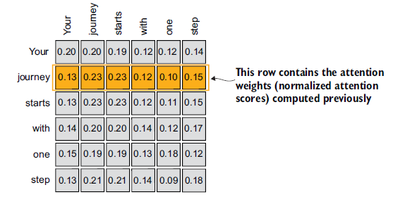
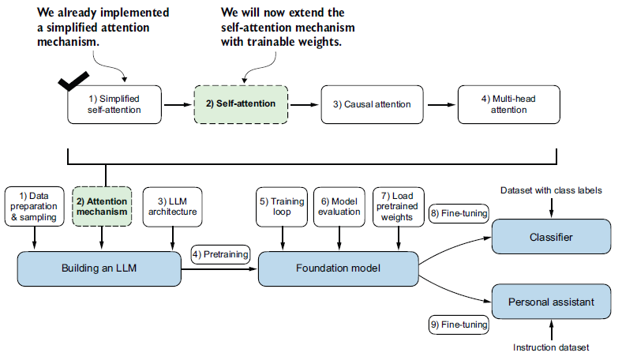
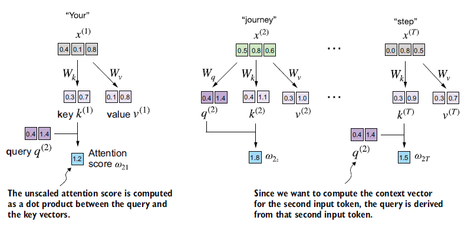
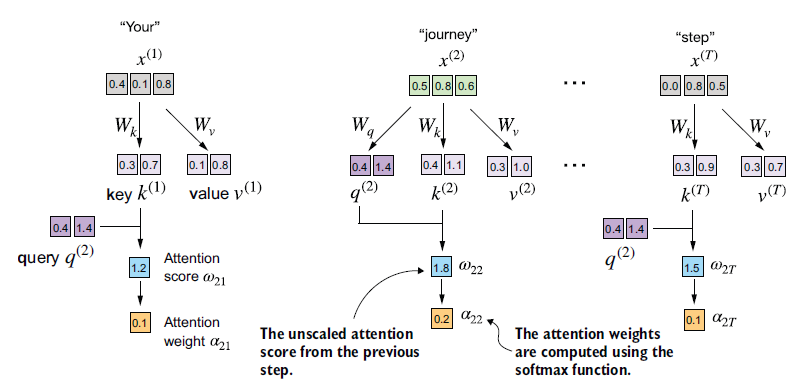
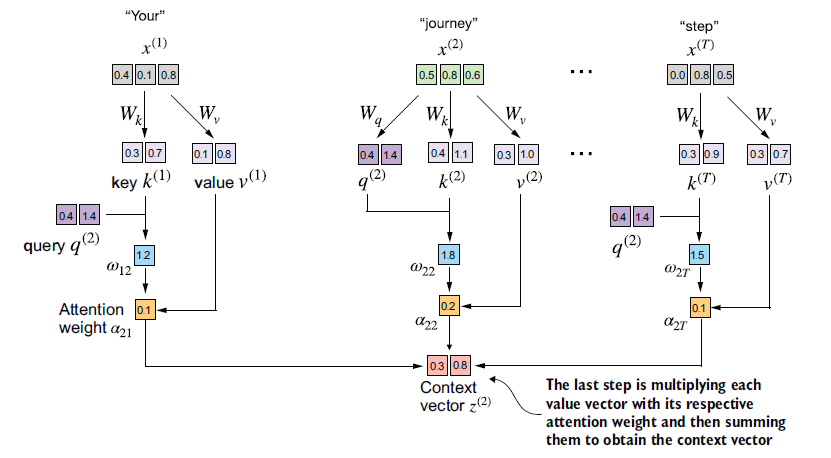
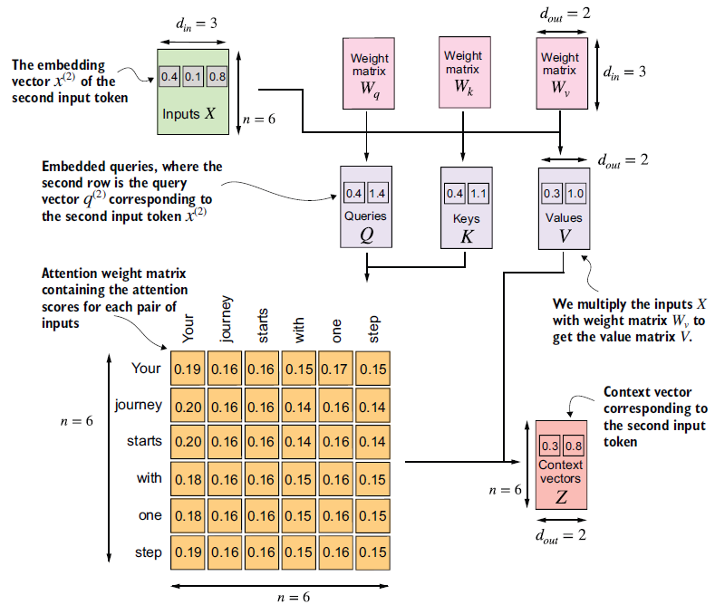

## Chapitre 3 — Mécanismes d'attention

### Introduction

Ce chapitre porte sur les **mécanismes d'attention**, qui constituent le cœur de l'architecture des LLMs. L'objectif est d'en comprendre le fonctionnement de manière isolée et mécanique, avant de les intégrer dans le modèle complet au chapitre 4.

<div align="center">


*Figure 3.1 : Les trois grandes étapes de la construction d'un LLM. Ce chapitre se concentre sur l'étape 2 de la phase 1 : l'implémentation des mécanismes d'attention.*

</div>

Quatre variantes du mécanisme d'attention seront implémentées progressivement, chacune construisant sur la précédente :

1. **Self-attention simplifiée** — version épurée, sans poids apprenables, pour saisir la logique fondamentale.
2. **Self-attention avec poids apprenables** — version complète, entraînable.
3. **Attention causale** (*causal attention*) — un masque est ajouté pour que le modèle ne puisse pas « voir » les tokens futurs lors de la génération, token par token.
4. **Attention multi-têtes** (*multi-head attention*) — plusieurs mécanismes d'attention opèrent en parallèle, permettant au modèle de capturer simultanément différents aspects des relations entre tokens.

<div align="center">


*Figure 3.2 : Les quatre variantes d'attention implémentées dans ce chapitre, de la self-attention simplifiée jusqu'à l'attention multi-têtes.*

</div>

L'implémentation finale de l'attention multi-têtes sera directement réutilisée dans l'architecture du LLM au chapitre suivant.

---

### 3.1 Le problème de la modélisation des longues séquences

Avant d'introduire le mécanisme de *self-attention*, il est utile de comprendre le problème qu'il vient résoudre — et pourquoi les architectures qui le précèdent étaient insuffisantes.

#### Le contexte : la traduction automatique

Prenons l'exemple d'un modèle de traduction. Une traduction mot à mot est impossible : les structures grammaticales des langues source et cible divergent trop profondément.

<div align="center">


*Figure 3.3 : Traduire mot à mot est insuffisant. La traduction exige une compréhension du contexte global et un réalignement grammatical entre les deux langues.*

</div>

La solution classique consiste à utiliser une architecture **encodeur–décodeur** : l'encodeur lit et compresse la séquence d'entrée, le décodeur produit la séquence traduite à partir de cette représentation compressée.

#### L'architecture encodeur–décodeur avec RNN

Avant les Transformers, les **réseaux de neurones récurrents** (RNNs) dominaient cette tâche. Un RNN traite la séquence token par token, en maintenant un **état caché** (*hidden state*) mis à jour à chaque étape — une sorte de mémoire interne qui se propage au fil de la séquence.

Dans un RNN encodeur–décodeur :
- L'**encodeur** parcourt toute la séquence d'entrée et tente de condenser son sens dans un **unique vecteur d'état caché final**.
- Le **décodeur** prend ce vecteur comme point de départ et génère la traduction token par token, en maintenant son propre état caché à chaque étape.

<div align="center">


*Figure 3.4 : Dans un RNN encodeur–décodeur, l'encodeur compresse toute la séquence source en un unique état caché final, que le décodeur utilise ensuite pour générer la traduction token par token.*

</div>

#### La limite fondamentale

Ce vecteur d'état caché final constitue le **goulot d'étranglement** de l'architecture. Toute l'information de la séquence d'entrée — quelle que soit sa longueur — doit tenir dans ce seul vecteur. Lors du décodage, le modèle n'a plus accès aux états cachés intermédiaires de l'encodeur : il ne dispose que de cette représentation compressée.

Sur des phrases courtes, cela fonctionne. Sur des séquences longues avec des dépendances distantes, le contexte se dilue et se perd — c'est la **perte de contexte à longue portée**.

> C'est précisément cette limitation qui a motivé l'invention des mécanismes d'attention : plutôt que de forcer toute l'information dans un unique vecteur, permettre au décodeur d'**accéder directement à tous les états cachés de l'encodeur**, en pondérant leur pertinence selon le token en cours de génération.

---

### 3.2 Capturer les dépendances avec les mécanismes d'attention

#### L'attention de Bahdanau (2014) — première rupture

Pour contourner le goulot d'étranglement du vecteur caché unique, Bahdanau et al. proposent en 2014 une modification du RNN encodeur–décodeur : plutôt que de transmettre uniquement l'état caché final, **tous les états cachés intermédiaires de l'encodeur restent accessibles**. À chaque étape de décodage, le décodeur calcule un score de pertinence pour chacun d'eux et pondère sa lecture en conséquence — c'est ce qu'on appelle les **poids d'attention** (*attention weights*).

<div align="center">


*Figure 3.5 : Avec un mécanisme d'attention, le décodeur peut accéder sélectivement à tous les tokens d'entrée. Certains tokens sont plus pertinents que d'autres pour générer un token donné en sortie — cette pertinence est quantifiée par les poids d'attention.*

</div>

#### Le Transformer (2017) — deuxième rupture

Trois ans plus tard, une découverte plus radicale : **le RNN lui-même n'est pas nécessaire**. L'architecture Transformer, proposée en 2017, conserve le principe des poids d'attention mais abandonne complètement la récursivité. Elle introduit la ***self-attention*** : un mécanisme par lequel chaque token d'une séquence peut directement peser la pertinence de **tous les autres tokens de la même séquence**, sans passer par des états cachés intermédiaires.

#### La self-attention en une phrase

> Pour calculer sa représentation, chaque token consulte l'ensemble de la séquence et décide, via des poids appris, à quels autres tokens il doit « prêter attention ».

C'est ce mécanisme qui est au cœur des LLMs modernes comme GPT, et c'est ce que ce chapitre va implémenter de zéro.

<div align="center">


*Figure 3.6 : La self-attention permet à chaque position de la séquence d'interagir avec toutes les autres et d'en pondérer l'importance. Ce chapitre en code l'implémentation complète.*

</div>

---
### 3.3 La self-attention : porter attention à différentes parties de l'entrée

#### Le « self » de self-attention

Le terme *self* désigne le fait que le mécanisme opère **au sein d'une seule et même séquence** : chaque token calcule ses poids d'attention en se comparant à tous les autres tokens de la même séquence. C'est ce qui le distingue de l'attention classique de Bahdanau, où les poids sont calculés entre deux séquences distinctes (entrée et sortie).

---

### 3.3.1 Self-attention simplifiée — sans poids apprenables

Avant d'introduire les poids apprenables, on implémente une version épurée pour saisir la logique fondamentale. L'objectif est de calculer, pour chaque token d'entrée $x^{(i)}$, un **vecteur de contexte** $z^{(i)}$ — une version enrichie de son embedding, qui intègre l'information de tous les autres tokens de la séquence.

<div align="center">


*Figure 3.7 : Pour chaque token d'entrée $x^{(i)}$, la self-attention calcule un vecteur de contexte $z^{(i)}$ en combinant tous les vecteurs d'entrée, pondérés par les poids d'attention $\alpha_{21}$ à $\alpha_{2T}$. Ici, on illustre le calcul de $z^{(2)}$ à partir du token « journey ».*

</div>

On travaille sur la phrase *"Your journey starts with one step."*, déjà encodée en vecteurs de dimension 3 :

```python
import torch

inputs = torch.tensor(
    [[0.43, 0.15, 0.89],  # Your     (x^1)
     [0.55, 0.87, 0.66],  # journey  (x^2)
     [0.57, 0.85, 0.64],  # starts   (x^3)
     [0.22, 0.58, 0.33],  # with     (x^4)
     [0.77, 0.25, 0.10],  # one      (x^5)
     [0.05, 0.80, 0.55]]  # step     (x^6)
)
```

Le calcul du vecteur de contexte $z^{(2)}$ se déroule en trois étapes.

---

#### Étape 1 — Calculer les scores d'attention (produit scalaire)

Pour le token *query* $x^{(2)}$ (« journey »), on calcule son **produit scalaire** (*dot product*) avec chacun des tokens de la séquence. Ce score mesure la similarité : plus il est élevé, plus les deux tokens sont alignés dans l'espace vectoriel et plus l'un doit « prêter attention » à l'autre.

```python
query = inputs[1]  # x^(2) : "journey"

attn_scores_2 = torch.empty(inputs.shape[0])
for i, x_i in enumerate(inputs):
    attn_scores_2[i] = torch.dot(x_i, query)

print(attn_scores_2)
```

```
tensor([0.9544, 1.4950, 1.4754, 0.8434, 0.7070, 1.0865])
```

<div align="center">


*Figure 3.8 : Les scores d'attention $\omega_{21}$ à $\omega_{2T}$ sont calculés comme le
produit scalaire entre le vecteur requête $x^{(2)}$ et chaque vecteur d'entrée.*

</div>

> **Produit scalaire.** C'est une multiplication terme à terme de deux vecteurs, dont on somme les résultats. Il est équivalent d'écrire la boucle explicite ou d'utiliser
> `torch.dot` :
> ```python
> res = 0.
> for idx, element in enumerate(inputs[0]):
>     res += inputs[0][idx] * query[idx]
> print(res)                          # tensor(0.9544)
> print(torch.dot(inputs[0], query))  # tensor(0.9544)
> ```

---

#### Étape 2 — Normaliser pour obtenir les poids d'attention (softmax)

On normalise les scores pour obtenir des **poids d'attention** qui somment à 1, les rendant interprétables comme des importances relatives.

Une normalisation naïve par la somme produit bien des poids valides :

```python
attn_weights_2_tmp = attn_scores_2 / attn_scores_2.sum()
print("Attention weights:", attn_weights_2_tmp)
print("Sum:", attn_weights_2_tmp.sum())
```

```
Attention weights: tensor([0.1455, 0.2278, 0.2249, 0.1285, 0.1077, 0.1656])
Sum: tensor(1.0000)
```

En pratique, on lui préfère systématiquement la **softmax** — pour deux raisons profondes.

##### Pourquoi la softmax et pas la normalisation simple ?

**Raison 1 — Stabilité numérique.** La softmax naïve calcule :

$$\text{softmax}(x_i) = \frac{e^{x_i}}{\sum_j e^{x_j}}$$

En float32, $e^x$ produit `inf` dès $x \approx 89$ (*overflow*) et s'annule à zéro dès
$x \approx -104$ (*underflow*). Sur de grandes séquences, les scores d'attention peuvent
facilement franchir ces seuils :

```python
torch.exp(torch.tensor(89.0))    # → tensor(inf) : overflow
torch.exp(torch.tensor(-104.0))  # → tensor(0.)  : underflow
```

On obtient alors `inf/inf = NaN` ou `0/0 = NaN`, et le gradient devient inexploitable.
PyTorch contourne cela avec l'astuce **log-sum-exp** : on soustrait le maximum des scores
avant d'exponentier,

$$\text{softmax}(x_i) = \frac{e^{x_i - \max(x)}}{\sum_j e^{x_j - \max(x)}}$$

ce qui est mathématiquement identique (le $e^{-\max(x)}$ se simplifie en numérateur et
dénominateur) mais numériquement stable : la valeur la plus grande devient $e^0 = 1$,
toutes les autres tombent dans $(0, 1]$.

**Raison 2 — Propriétés de gradient favorables.** Comparons les Jacobiens des deux
normalisations.

*Normalisation simple* $w_i = x_i / S$, $S = \sum_j x_j$ :

$$\frac{\partial w_i}{\partial x_i} = \frac{1 - w_i}{S} \qquad
\frac{\partial w_i}{\partial x_j} = \frac{-w_i}{S} \quad (j \neq i)$$

Le gradient dépend de $S$, la somme brute des scores : si $S$ est grand, le gradient
s'effondre et le signal de mise à jour se propage mal. De plus, cette formule exige des
scores positifs — ce que le produit scalaire ne garantit pas.

*Softmax* $w_i = e^{x_i} / Z$, $Z = \sum_k e^{x_k}$ :

> **Démonstration du Jacobien.** On applique la règle du quotient sur $w_i = e^{x_i}/Z$.
>
> *Cas $i = j$ :*
> $$\frac{\partial w_i}{\partial x_i}
>   = \frac{e^{x_i} Z - e^{x_i} e^{x_i}}{Z^2}
>   = \frac{e^{x_i}}{Z} - \left(\frac{e^{x_i}}{Z}\right)^2
>   = w_i - w_i^2
>   \;\Rightarrow\; \boxed{w_i(1 - w_i)}$$
>
> *Cas $i \neq j$ :* $\frac{\partial e^{x_i}}{\partial x_j} = 0$, mais
> $\frac{\partial Z}{\partial x_j} = e^{x_j}$, donc :
> $$\frac{\partial w_i}{\partial x_j}
>   = \frac{0 \cdot Z - e^{x_i} e^{x_j}}{Z^2}
>   = -\frac{e^{x_i}}{Z}\cdot\frac{e^{x_j}}{Z}
>   \;\Rightarrow\; \boxed{-w_i w_j}$$
>
> Les deux cas s'unifient avec le delta de Kronecker $\delta_{ij}$ :
> $$\boxed{\frac{\partial w_i}{\partial x_j} = w_i(\delta_{ij} - w_j)}$$

Ce Jacobien présente trois avantages concrets :

- **Gradient indépendant de l'échelle brute** : il ne dépend que de $w_i \in (0,1)$. Le signal reste dans un intervalle contrôlé quel que soit l'ordre de grandeur des scores.
- **Gradient strictement non nul** : puisque $w_i \in (0,1)$ strictement, $w_i(1-w_i) > 0$. Le signal de correction ne s'éteint jamais silencieusement.
- **Amplification des différences** : l'exponentielle accentue les écarts entre scores. Un petit avantage $\epsilon$ en score produit un avantage plus marqué en poids, générant des patterns d'attention plus tranchés et des gradients plus informatifs.


##### Implémentation

```python
# Version naïve — instable sur grandes valeurs
def softmax_naive(x):
    return torch.exp(x) / torch.exp(x).sum(dim=0)

# Version PyTorch — log-sum-exp intégré, à utiliser en pratique
attn_weights_2 = torch.softmax(attn_scores_2, dim=0)
print("Attention weights:", attn_weights_2)
print("Sum:", attn_weights_2.sum())
```

```
Attention weights: tensor([0.1385, 0.2379, 0.2333, 0.1240, 0.1082, 0.1581])
Sum: tensor(1.)
```

<div align="center">


*Figure 3.9 : Les scores d'attention $\omega_{21}$ à $\omega_{2T}$ sont normalisés via softmax
pour produire les poids d'attention $\alpha_{21}$ à $\alpha_{2T}$, qui somment à 1.*

</div>

---

#### Étape 3 — Calculer le vecteur de contexte (somme pondérée)

Le vecteur de contexte $z^{(2)}$ est la **somme pondérée** de tous les vecteurs d'entrée,
chacun multiplié par son poids d'attention :

$$z^{(2)} = \sum_{i} \alpha_{2i} \cdot x^{(i)}$$

```python
context_vec_2 = torch.zeros(query.shape)
for i, x_i in enumerate(inputs):
    context_vec_2 += attn_weights_2[i] * x_i

print(context_vec_2)
```

```
tensor([0.4419, 0.6515, 0.5683])
```

<div align="center">


*Figure 3.10 : $z^{(2)}$ est la somme pondérée de tous les vecteurs d'entrée $x^{(1)}$ à
$x^{(T)}$, pondérés par les poids d'attention correspondants.*

</div>

Contrairement à l'embedding brut de « journey » `[0.55, 0.87, 0.66]`, le vecteur de
contexte $z^{(2)}$ `[0.4419, 0.6515, 0.5683]` encode non seulement le sens de « journey »,
mais aussi **sa relation pondérée avec tous les autres tokens de la phrase**.

La prochaine étape consiste à généraliser ce calcul pour produire simultanément tous les
vecteurs de contexte $z^{(1)}$ à $z^{(T)}$.

---

### 3.3.2 Généralisation — poids d'attention pour tous les tokens

On applique le même pipeline à **tous les tokens simultanément**, en remplaçant les boucles par des opérations matricielles.

<div align="center">



*Figure 3.11 : On étend le calcul de la section précédente à toutes les lignes — un vecteur de contexte $z^{(i)}$ par token.*

</div>

---

#### Étape 1 — Scores d'attention pour toutes les paires

```python
attn_scores = inputs @ inputs.T
print(attn_scores)
```

```
tensor([[0.9995, 0.9544, 0.9422, 0.4753, 0.4576, 0.6310],
        [0.9544, 1.4950, 1.4754, 0.8434, 0.7070, 1.0865],
        ...])
```

> **Pourquoi `inputs @ inputs.T` est équivalent à la double boucle.** `inputs` est une matrice de forme `(6, 3)` — 6 tokens, chacun représenté par un vecteur de dimension 3. `inputs.T` est sa transposée, de forme `(3, 6)`. Leur produit matriciel produit un tenseur `(6, 6)` dont l'élément $(i, j)$ vaut $\sum_k \text{inputs}[i,k] \times \text{inputs}[j,k]$ — exactement le produit scalaire entre les tokens $i$ et $j$, ce que la double boucle calculait explicitement.

#### Étape 2 — Normalisation par softmax

```python
attn_weights = torch.softmax(attn_scores, dim=-1)
```

> **`dim=-1`** indique à PyTorch d'appliquer la softmax le long de la dernière dimension — ici les colonnes. Chaque ligne est normalisée indépendamment, de sorte que ses valeurs somment à 1.

#### Étape 3 — Vecteurs de contexte

```python
all_context_vecs = attn_weights @ inputs
print(all_context_vecs)
```

```
tensor([[0.4421, 0.5931, 0.5790],
        [0.4419, 0.6515, 0.5683],
        [0.4431, 0.6496, 0.5671],
        [0.4304, 0.6298, 0.5510],
        [0.4671, 0.5910, 0.5266],
        [0.4177, 0.6503, 0.5645]])
```

`attn_weights` est `(6, 6)` et `inputs` est `(6, 3)` : le produit donne `(6, 3)`, où chaque ligne $i$ est la somme pondérée de tous les vecteurs d'entrée par les poids d'attention du token $i$.

Cette version reste sans paramètres apprenables. La section suivante introduit les matrices $W_Q$, $W_K$, $W_V$ pour rendre ce mécanisme véritablement entraînable.

### 3.4 Self-attention avec poids apprenables

<div align="center">



*Figure 3.13 : On enrichit le mécanisme précédent avec des matrices de poids apprenables.
Les extensions (masque causal, multi-têtes) viendront ensuite.*

</div>

La différence structurelle avec la version simplifiée est l'introduction de **trois matrices de poids apprenables** $W_Q$, $W_K$, $W_V$, mises à jour par rétropropagation. Ce sont elles qui donnent au modèle la capacité d'apprendre *quel type* de similarité est pertinent pour la tâche, plutôt que de mesurer une similarité brute entre embeddings.

---

### 3.4.1 Calcul pas à pas

#### Les trois matrices de projection et leur rôle

Chaque token d'entrée $x^{(i)}$ est projeté dans **trois sous-espaces distincts** via ces matrices :

$$q^{(i)} = x^{(i)} W_Q \qquad k^{(i)} = x^{(i)} W_K \qquad v^{(i)} = x^{(i)} W_V$$

Les termes *query*, *key* et *value* viennent du domaine des bases de données et de la recherche d'information :

- **Query $q^{(i)}$** — la requête émise par le token $i$ pour interroger tous les autres tokens : elle lui permet de trouver, parmi eux, ceux qui sont pertinents pour construire sa représentation contextuelle.

- **Key $k^{(j)}$** — la clé d'indexation du token $j$ : chaque token expose une clé qui sera comparée aux requêtes des autres tokens pour déterminer sa pertinence.

- **Value $v^{(j)}$** — le contenu informationnel réel du token $j$, analogue à la valeur dans une paire clé-valeur d'un dictionnaire : c'est ce qui est effectivement transmis si le token est jugé pertinent.

Le mécanisme procède alors en trois temps : comparer la query $q^{(i)}$ à toutes les keys via le produit scalaire $\omega_{ij} = q^{(i)} \cdot k^{(j)}$, identifier les tokens les plus pertinents via la softmax, puis récupérer les values correspondantes pondérées par ces scores pour former le vecteur de contexte $z^{(i)}$.

C'est un peu comme le fonctionnement d'un moteur de recherche : tu tapes "meilleures pizzerias à Paris" (*query*), Google la compare aux titres et métadonnées de chaque page indexée (*keys*), puis retourne le contenu réel des pages les plus pertinentes (*values*).

Dans la version simplifiée de la section 3.3, $q = k = v = x$ : il n'y avait aucune projection apprise, et la similarité mesurée était la proximité brute entre embeddings. L'introduction de $W_Q$, $W_K$, $W_V$ permet au modèle d'apprendre des représentations spécialisées pour chacun de ces trois rôles.

> **Poids de la matrice vs poids d'attention.** Les éléments de $W_Q$, $W_K$, $W_V$ sont des **paramètres appris** — des scalaires optimisés par descente de gradient, fixes une fois l'entraînement terminé. Les poids d'attention $\alpha_{ij}$ sont eux **dynamiques** : recalculés à chaque forward pass en fonction de l'entrée courante. Ce sont deux usages distincts du mot « poids ».

---

#### Implémentation

```python
x_2 = inputs[1]          # token "journey", shape : (3,)
d_in  = inputs.shape[1]  # 3
d_out = 2                 # dimension de sortie (dans GPT, d_in == d_out)

torch.manual_seed(123)
W_query = torch.nn.Parameter(torch.rand(d_in, d_out), requires_grad=False)
W_key   = torch.nn.Parameter(torch.rand(d_in, d_out), requires_grad=False)
W_value = torch.nn.Parameter(torch.rand(d_in, d_out), requires_grad=False)
```

`requires_grad=False` désactive ici le calcul du gradient sur ces matrices — uniquement pour alléger les affichages. En entraînement réel, on poserait `requires_grad=True` pour qu'elles soient mises à jour par rétropropagation.

On projette $x^{(2)}$ et l'ensemble des tokens :

```python
query_2 = x_2 @ W_query   # shape : (2,)
keys    = inputs @ W_key   # shape : (6, 2)
values  = inputs @ W_value # shape : (6, 2)

print(query_2)
```

```
tensor([0.4306, 1.4551])
```

On a projeté les 6 tokens de dimension 3 vers un espace de dimension 2. On calcule uniquement `query_2` pour le token courant, mais on a besoin des **keys et values de tous les tokens** pour pondérer leur contribution au vecteur de contexte de $x^{(2)}$.

---

#### Étape 1 — Scores d'attention

<div align="center">



*Figure 3.15 : Les scores sont maintenant calculés entre les projections query/key, et non
plus directement entre les embeddings bruts.*

</div>

```python
attn_scores_2 = query_2 @ keys.T
print(attn_scores_2)
```

```
tensor([1.2705, 1.8524, 1.8111, 1.0795, 0.5577, 1.5440])
```

---

#### Étape 2 — Passage aux poids d'attention : le facteur $1/\sqrt{d_k}$

<div align="center">



*Figure 3.16 : Les scores sont mis à l'échelle avant la softmax.*

</div>

```python
d_k = keys.shape[-1]  # dimension des keys = 2
attn_weights_2 = torch.softmax(attn_scores_2 / d_k**0.5, dim=-1)
print(attn_weights_2)
```

```
tensor([0.1500, 0.2264, 0.2199, 0.1311, 0.0906, 0.1820])
```

Tu as raison. Voici la version avec ces termes remplacés par des formulations directes :

---

**Pourquoi diviser par $\sqrt{d_k}$ ?** 

C'est la justification qui donne son nom à l'architecture : *scaled dot-product attention*.

Supposons que les composantes de $q$ et $k$ soient approximativement i.i.d. de loi $\mathcal{N}(0, 1)$. Le produit scalaire $q \cdot k = \sum_{l=1}^{d_k} q_l k_l$ est alors une somme de $d_k$ variables aléatoires indépendantes de moyenne 0 et de variance 1, donc :

$$\text{Var}(q \cdot k) = d_k \qquad \Rightarrow \qquad \sigma(q \cdot k) = \sqrt{d_k}$$

<details> <summary>Démonstration</summary> 

**Posons** $q_l \sim \mathcal{N}(0,1)$ et $k_l \sim \mathcal{N}(0,1)$, indépendantes.

**Étape 1 — Variance du produit $q_l k_l$**

$$\text{Var}(q_l k_l) = \mathbb{E}[q_l^2 k_l^2] - \mathbb{E}[q_l k_l]^2$$

Puisque $q_l, k_l \sim \mathcal{N}(0,1)$ indépendantes, leurs carrés suivent des lois du khi-deux à 1 degré de liberté indépendantes :

$$q_l^2 \sim \chi^2(1) \qquad k_l^2 \sim \chi^2(1) \quad \text{indépendantes}$$

Pour une loi $\chi^2(1)$ : $\mathbb{E}[X] = 1$. Par indépendance de $q_l^2$ et $k_l^2$ :

$$\mathbb{E}[q_l^2 k_l^2] = \mathbb{E}[q_l^2]\,\mathbb{E}[k_l^2] = 1 \times 1 = 1$$

Et $\mathbb{E}[q_l k_l] = \mathbb{E}[q_l]\,\mathbb{E}[k_l] = 0$, donc :

$$\text{Var}(q_l k_l) = 1 - 0 = 1$$

**Étape 2 — Variance de la somme $q \cdot k = \sum_{l=1}^{d_k} q_l k_l$**

Les termes $q_l k_l$ sont indépendants entre eux (les indices $l$ sont distincts), donc la variance de leur somme est la somme de leurs variances :

$$\text{Var}(q \cdot k) = \sum_{l=1}^{d_k} \text{Var}(q_l k_l) = \sum_{l=1}^{d_k} 1 = d_k$$

**Étape 3 — Écart-type**

$$\sigma(q \cdot k) = \sqrt{\text{Var}(q \cdot k)} = \sqrt{d_k}$$

**Étape 4 — Après mise à l'échelle par $\sqrt{d_k}$**

$$\text{Var}\!\left(\frac{q \cdot k}{\sqrt{d_k}}\right) = \frac{1}{(\sqrt{d_k})^2}\,\text{Var}(q \cdot k) = \frac{d_k}{d_k} = 1$$

La variance est ramenée à 1 quelle que soit la valeur de $d_k$. $\blacksquare$    

</details>

<br>

Pour $d_k = 1024$ (typique dans GPT), les produits scalaires ont un écart-type de l'ordre de 32. La softmax reçoit donc des entrées très étalées : les grandes valeurs poussent vers 1, les petites vers 0, et la distribution ressemble à un vecteur one-hot.

Or le gradient de la softmax est $w_i(1 - w_i)$ : quand $w_i \to 1$ ou $w_i \to 0$, ce gradient tend vers 0. On retombe dans le problème du gradient évanescent — l'entraînement stagne.

En divisant par $\sqrt{d_k}$, on ramène la variance du score à 1 :

$$\text{Var}\!\left(\frac{q \cdot k}{\sqrt{d_k}}\right) = \frac{d_k}{d_k} = 1$$

Les entrées de la softmax restent dans des plages raisonnables quel que soit $d_k$ — les poids d'attention ne s'écrasent plus vers 0 ou 1, et les gradients restent exploitables.

---

#### Étape 3 — Vecteur de contexte

<div align="center">



*Figure 3.17 : Le vecteur de contexte est la somme pondérée des vecteurs value — et non
plus des embeddings bruts.*

</div>

```python
context_vec_2 = attn_weights_2 @ values
print(context_vec_2)
```

```
tensor([0.3061, 0.8210])
```

La différence fondamentale avec la section 3.3 : on somme les **vecteurs value** $v^{(j)}$, pas les embeddings bruts $x^{(j)}$. $W_V$ permet au modèle d'apprendre quelle information extraire de chaque token pour la transmettre — indépendamment de la façon dont ce token est indexé (key) ou de la façon dont il interroge les autres (query).

Explicitement, le vecteur de contexte de $x^{(2)}$ s'écrit :

$$z^{(2)} = \sum_{j=1}^{T} \alpha_{2j} \cdot v^{(j)} = \sum_{j=1}^{T} \alpha_{2j} \cdot x^{(j)} W_V$$

En forme matricielle compacte, pour l'ensemble des tokens simultanément :

$$Z = \text{softmax}\!\left(\frac{Q K^\top}{\sqrt{d_k}}\right) V$$

où $Q = X W_Q$, $K = X W_K$, $V = X W_V$ sont les projections de toute la séquence, et chaque ligne $i$ de $Z$ est le vecteur de contexte $z^{(i)}$.

---
## 3.4.2 Encapsulation en classe Python

Le code précédent est réorganisé en une classe `nn.Module` — la brique de base de tout modèle PyTorch, qui gère automatiquement l'enregistrement des paramètres, leur mise à jour lors de l'entraînement, et le déplacement sur GPU.

```python
import torch.nn as nn

class SelfAttention_v1(nn.Module):
    def __init__(self, d_in, d_out):
        super().__init__()
        self.W_query = nn.Parameter(torch.rand(d_in, d_out))
        self.W_key   = nn.Parameter(torch.rand(d_in, d_out))
        self.W_value = nn.Parameter(torch.rand(d_in, d_out))

    def forward(self, x):
        keys    = x @ self.W_key
        queries = x @ self.W_query
        values  = x @ self.W_value
        attn_scores  = queries @ keys.T
        attn_weights = torch.softmax(attn_scores / keys.shape[-1]**0.5, dim=-1)
        context_vec  = attn_weights @ values
        return context_vec
```

```python
torch.manual_seed(123)
sa_v1 = SelfAttention_v1(d_in, d_out)
print(sa_v1(inputs))
```

```
tensor([[0.2996, 0.8053],
        [0.3061, 0.8210],
        [0.3058, 0.8203],
        [0.2948, 0.7939],
        [0.2927, 0.7891],
        [0.2990, 0.8040]], grad_fn=<MmBackward0>)
```

<div align="center">



*Figure 3.18 : Résumé matriciel de la self-attention. $X$ est projeté en $Q$, $K$, $V$ via les trois matrices de poids. Les scores $QK^\top / \sqrt{d_k}$ sont normalisés par softmax, puis multipliés par $V$ pour produire $Z$.*

</div>

---

### Version améliorée : `SelfAttention_v2` avec `nn.Linear`

**Initialisation des poids.** Dans `SelfAttention_v1`, `nn.Parameter(torch.rand(...))` tire chaque poids indépendamment selon $W_{ij} \sim \mathcal{U}[0, 1)$. Cette initialisation est naïve pour deux raisons :

- Les poids initiaux sont tous **positifs**, ce qui restreint la dynamique d'apprentissage. Une bonne initialisation doit au contraire différencier efficacement les neurones dès le départ en assignant des poids aléatoires de signes variés (on parle de **Symmetry breaking** dans la littérature);
  
<br>
  
- la variance $\operatorname{Var}(W_{ij}) = \frac{1}{12}$ est indépendante de $d_{in}$, ce qui fait exploser la variance de la sortie $XW$ quand $d_{in}$ est grand.

<details>
<summary>Démonstration</summary>

$K = XW$ est la projection des embeddings d'entrée dans l'espace key, avec $K \in \mathbb{R}^{n \times d_{out}}$ : chaque ligne est le vecteur key d'un token, chaque colonne est une dimension de l'espace key. On s'intéresse au scalaire :

$$y = K_{i,j} = \sum_{k=1}^{d_{in}} x_{i,k}\, W_{k,j}$$

la $j$-ième composante du vecteur key du token $i$. C'est cette somme dont on analyse la variance pour quantifier l'effet de l'initialisation.

**Hypothèses de travail.** On suppose $x_k$ et $W_k$ indépendants, $\mathbb{E}[x_k] = 0$ et $\operatorname{Var}(x_k) = \sigma^2$ — hypothèse standard vérifiée après normalisation des entrées.

**Variance d'un terme $x_k W_k$.** Avec $\mathbb{E}[x_k] = 0$ :

$$\operatorname{Var}(x_k W_k) = \mathbb{E}[x_k^2 W_k^2] - \mathbb{E}[x_k W_k]^2 = \mathbb{E}[x_k^2]\,\mathbb{E}[W_k^2] - \underbrace{\mathbb{E}[x_k]^2}_{=\,0}\mathbb{E}[W_k]^2 = \sigma^2\,\mathbb{E}[W_k^2]$$

La quantité clé est $\mathbb{E}[W_k^2]$, qui se décompose comme :

$$\mathbb{E}[W_k^2] = \operatorname{Var}(W_k) + \mathbb{E}[W_k]^2$$

**Rappel : loi uniforme $\mathcal{U}[a,b]$.**

$$\operatorname{Var}(W) = \frac{(b-a)^2}{12}, \qquad \mathbb{E}[W] = \frac{a+b}{2}$$

**Cas `torch.rand` : $W_k \sim \mathcal{U}[0, 1)$.**

$$\mathbb{E}[W_k] = \frac{1}{2}, \qquad \operatorname{Var}(W_k) = \frac{1}{12}$$

$$\mathbb{E}[W_k^2] = \frac{1}{12} + \frac{1}{4} = \frac{1}{3}$$

$$\operatorname{Var}(y) = \sum_{k=1}^{d_{in}} \sigma^2 \cdot \frac{1}{3} = \frac{d_{in}\,\sigma^2}{3}$$

La variance croît **linéairement** avec $d_{in}$ — pour $d_{in} = 512$, elle est 512 fois plus grande que la variance d'entrée.

**Cas Kaiming : $W_k \sim \mathcal{U}\!\left(-\dfrac{1}{\sqrt{d_{in}}}, \dfrac{1}{\sqrt{d_{in}}}\right)$.**

$$\mathbb{E}[W_k] = 0, \qquad \operatorname{Var}(W_k) = \frac{\left(\frac{2}{\sqrt{d_{in}}}\right)^2}{12} = \frac{1}{3\,d_{in}}$$

$$\mathbb{E}[W_k^2] = \frac{1}{3\,d_{in}} + 0 = \frac{1}{3\,d_{in}}$$

$$\operatorname{Var}(y) = \sum_{k=1}^{d_{in}} \sigma^2 \cdot \frac{1}{3\,d_{in}} = \frac{\sigma^2}{3}$$

Le $d_{in}$ se simplifie — la variance reste constante quelle que soit la dimension d'entrée.

</details>

`nn.Linear` utilise par défaut l'**initialisation de Kaiming** (He, 2015), qui fixe :

$$W_{ij} \sim \mathcal{U}\!\left(-\frac{1}{\sqrt{d_{in}}},\ \frac{1}{\sqrt{d_{in}}}\right) \qquad \Longrightarrow \qquad \operatorname{Var}(W_{ij}) = \frac{1}{3\,d_{in}}$$

ce qui maintient la variance du signal constante à travers les couches, quelle que soit la dimension.

---

**`nn.Linear` comme opérateur linéaire.** Dans `SelfAttention_v1`, on définit $W \in \mathbb{R}^{d_{in} \times d_{out}}$ comme un `nn.Parameter`, et le forward calcule :

$$K = XW, \qquad X \in \mathbb{R}^{n \times d_{in}},\quad K \in \mathbb{R}^{n \times d_{out}}$$

`nn.Linear(d_in, d_out, bias=False)` stocke en interne une matrice $\widetilde{W} \in \mathbb{R}^{d_{out} \times d_{in}}$, et son appel sur $X$ calcule :

$$K = X\,\widetilde{W}^\top$$

Les deux expressions sont identiques si et seulement si $\widetilde{W} = W^\top$ — ce qui est exactement la convention de stockage de `nn.Linear`. Les deux implémentations sont donc **strictement équivalentes**.

```python
class SelfAttention_v2(nn.Module):
    def __init__(self, d_in, d_out, qkv_bias=False):
        super().__init__()
        self.W_query = nn.Linear(d_in, d_out, bias=qkv_bias)
        self.W_key   = nn.Linear(d_in, d_out, bias=qkv_bias)
        self.W_value = nn.Linear(d_in, d_out, bias=qkv_bias)

    def forward(self, x):
        keys    = self.W_key(x)
        queries = self.W_query(x)
        values  = self.W_value(x)
        attn_scores  = queries @ keys.T
        attn_weights = torch.softmax(attn_scores / keys.shape[-1]**0.5, dim=-1)
        context_vec  = attn_weights @ values
        return context_vec
```

```python
torch.manual_seed(789)
sa_v2 = SelfAttention_v2(d_in, d_out)
print(sa_v2(inputs))
```

```
tensor([[-0.0739,  0.0713],
        [-0.0748,  0.0703],
        [-0.0749,  0.0702],
        [-0.0760,  0.0685],
        [-0.0763,  0.0679],
        [-0.0754,  0.0693]], grad_fn=<MmBackward0>)
```

Les sorties diffèrent entre `v1` et `v2` uniquement parce que les poids initiaux sont différents — la logique du forward pass est identique.

---

> **Exercice 3.1.** Transférer les poids de `SelfAttention_v2` vers `SelfAttention_v1` et vérifier que les deux implémentations produisent les mêmes sorties sur `inputs`.

---

La prochaine étape enrichit ce mécanisme de deux extensions : le **masque causal**, qui empêche chaque token d'accéder aux tokens futurs lors de la génération, et l'**attention multi-têtes**, qui fait tourner plusieurs mécanismes d'attention en parallèle pour capter différents types de relations entre tokens.